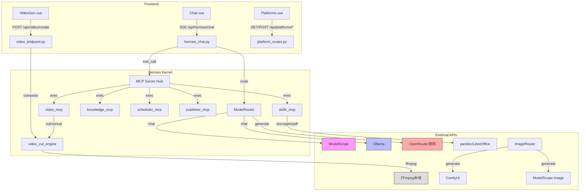

> ⚠️ **本文档已废弃（2026-06-28）**
> 大部分内容已实施完毕或与当前代码库状态不符：
> - **Phase 1-3 已完成**: `VolcEngineClient` 已实现、`ModelRouter` 多后端故障转移已就绪、`video_endpoint.py` 已使用 VolcEngine AI 视频
> - **错误主张**: "视频生成无 AI 能力"——`video_endpoint.py` 已实现 AI 视频生成
> - **错误主张**: "ModelRouter 无统一入口"——`model_router.py` 已有完整多后端故障转移（VolcEngine > Ollama > LiteLLM > OpenRouter）
> - **前端引用过时**: 架构图仅显示 5 个页面（Chat/Hub/VideoGen/Publisher/Platforms），实际代码库有 34 个页面
> - **API 密钥硬编码指控**: 代码已使用多来源配置加载（环境变量/config.yaml/secrets.yaml）
> - **剩余有效内容**（已记录在 SSOT 中）: TTS/语音克隆/嵌入端点未配置（`config.yaml` 中端点 ID 为空）
>
> **请使用**: `szyg产品功能融合设计.md` M1 模块了解当前 VolcEngine 集成状态
> **不再更新本文档。**

---

# 「域灵」数字员工系统 — 火山引擎API集成优化方案

> **版本**: v1.0 | **日期**: 2026-06-09 | **状态**: 设计评审
>
> 目标: 厘清外接API与内部组件关系，以Hermes为内核构建高可信数字员工系统，通过火山引擎统一API显著提升系统效率和AIGC质量。

---

## 一、架构关系总览

### 1.1 系统三层架构

```
┌─────────────────────────────────────────────────────────────────────────────┐
│                              用户交互层 (Frontend)                           │
│  ┌─────────┐  ┌─────────┐  ┌─────────┐  ┌─────────┐  ┌─────────┐           │
│  │ Chat.vue│  │Hub.vue  │  │VideoGen │  │Publisher│  │Platforms│           │
│  │ (对话)  │  │(工具市场)│  │(视频创作)│  │(发布)   │  │(平台管理)│           │
│  └────┬────┘  └────┬────┘  └────┬────┘  └────┬────┘  └────┬────┘           │
└───────┼────────────┼────────────┼────────────┼────────────┼────────────────┘
        │            │            │            │            │
        ▼            ▼            ▼            ▼            ▼
┌─────────────────────────────────────────────────────────────────────────────┐
│                           API网关层 (FastAPI)                                │
│  ┌──────────────┐  ┌──────────────┐  ┌──────────────┐  ┌──────────────┐     │
│  │hermes_chat.py│  │video_endpoint│  │platform_route│  │publisher.py  │     │
│  │ /api/hermes/ │  │ /api/video/  │  │ /api/platform│  │ /api/publish │     │
│  │    chat      │  │   create     │  │   /publish   │  │  /contents   │     │
│  └──────┬───────┘  └──────┬───────┘  └──────┬───────┘  └──────┬───────┘     │
└─────────┼─────────────────┼─────────────────┼─────────────────┼─────────────┘
          │                 │                 │                 │
          ▼                 ▼                 ▼                 ▼
┌─────────────────────────────────────────────────────────────────────────────┐
│                          Hermes内核层 (Agent Core)                           │
│  ┌──────────────┐  ┌──────────────┐  ┌──────────────┐  ┌──────────────┐     │
│  │  ModelRouter │  │  ImageRouter │  │  Scheduler   │  │  Publisher   │     │
│  │  模型路由器   │  │  图像路由器   │  │  调度引擎     │  │  发布管道     │     │
│  └──────┬───────┘  └──────┬───────┘  └──────┬───────┘  └──────┬───────┘     │
│         │                 │                 │                 │             │
│  ┌──────┴─────────────────┴─────────────────┴─────────────────┴──────┐      │
│  │                     MCP Server Hub (9个MCP服务)                     │      │
│  │  publisher | scheduler | tools | knowledge | agents | oem | skills │      │
│  └───────────────────────────────────────────────────────────────────┘      │
└─────────────────────────────────────────────────────────────────────────────┘
          │                 │                 │                 │
          ▼                 ▼                 ▼                 ▼
┌─────────────────────────────────────────────────────────────────────────────┐
│                        外接API层 (External APIs)                             │
│  ┌──────────────┐  ┌──────────────┐  ┌──────────────┐  ┌──────────────┐     │
│  │  ModelScope  │  │  ComfyUI     │  │  Edge-TTS    │  │  火山引擎(新增) │    │
│  │  (LLM+图像)  │  │  (本地SD)    │  │  (语音合成)   │  │  (统一入口)   │    │
│  └──────────────┘  └──────────────┘  └──────────────┘  └──────────────┘     │
└─────────────────────────────────────────────────────────────────────────────┘
```

### 1.2 当前外接API使用矩阵

| 功能域 | 当前API | 调用方式 | 可靠性 | 质量 | 备注 |
|--------|---------|---------|--------|------|------|
| **LLM推理** | ModelScope (DeepSeek-V4) | OpenAI兼容/SDK | ⭐⭐⭐ | ⭐⭐⭐⭐ | 国内访问稳定 |
| **LLM推理** | Ollama (本地Qwen3) | HTTP API | ⭐⭐⭐⭐⭐ | ⭐⭐ | 离线可用，质量一般 |
| **LLM推理** | OpenRouter | OpenAI兼容 | ❌已停用 | - | 免费模型不稳定 |
| **图像生成** | ComfyUI (本地SD) | HTTP API | ⭐⭐⭐⭐ | ⭐⭐⭐ | 需GPU，本地无限 |
| **图像生成** | ModelScope Z-Image | 异步轮询 | ⭐⭐⭐ | ⭐⭐⭐ | 中文支持好 |
| **语音合成** | Edge-TTS (微软) | 本地调用 | ⭐⭐⭐⭐⭐ | ⭐⭐⭐ | 免费，中文自然 |
| **视频生成** | ❌ 无AI视频API | 仅FFmpeg本地 | ⭐⭐⭐⭐⭐ | ⭐ | 纯文字+纯色背景 |

### 1.3 内部组件依赖关系



---

## 二、问题诊断

### 2.1 核心痛点

#### 🔴 P1: 视频生成无AI能力
- **现状**: `video_endpoint.py` 仅使用FFmpeg生成纯色背景+文字叠加的"幻灯片视频"
- **影响**: 无法生成真正的AI视频内容，AIGC质量极低
- **用户感知**: "这根本不是AI视频，就是PPT转视频"

#### 🔴 P2: 多模型调用分散，无统一入口
- **现状**: LLM有3个独立客户端(ModelScope/Ollama/OpenRouter)，图像有2个(ComfyUI/ModelScope)
- **影响**: 每个客户端独立维护、独立配置、独立故障处理
- **代码冗余**: `model_router.py` 中每个backend一个if分支，扩展成本高

#### 🟡 P3: 无高可靠商业级API保障
- **现状**: 依赖免费/开源方案，无SLA保障
- **影响**: ModelScope偶尔限流、Ollama冷启动慢、OpenRouter免费模型已停用
- **生产风险**: 企业级部署缺乏可靠性背书

#### 🟡 P4: TTS质量天花板明显
- **现状**: Edge-TTS虽免费但情感表达有限，无声音克隆能力
- **影响**: 数字人/配音场景体验不佳

#### 🟡 P5: 缺乏多模态统一调度
- **现状**: 文本、图像、语音、视频各自独立路由
- **影响**: 无法根据任务类型智能选择最优模型组合

### 2.2 技术债务

| 位置 | 问题 | 影响 |
|------|------|------|
| `hermes_chat.py:47-49` | API_KEY硬编码从secrets.yaml读取，无多密钥轮换 | 单点故障 |
| `model_router.py:38-49` | 后端检测顺序硬编码，无动态配置 | 扩展性差 |
| `video_endpoint.py` | 仅支持FFmpeg，无AI视频生成 | 功能缺失 |
| `publisher.py:385-411` | ai_generate仅mock，未真正调用LLM | AI内容质量低 |
| `image_router.py` | 无智能backend选择策略 | 资源浪费 |

---

## 三、火山引擎API优势分析

### 3.1 火山引擎方舟平台核心能力

火山引擎方舟(ARK)平台提供**统一的OpenAI兼容API入口**，一个API Key可调用多个模型：

| 模型类别 | 可用模型 | 场景匹配 |
|----------|---------|---------|
| **文本对话** | Doubao-pro-128k / Doubao-lite / DeepSeek-R1 / DeepSeek-V3 | Hermes聊天、内容生成 |
| **图像生成** | 豆包·文生图 / SDXL / FLUX | 封面图、营销素材 |
| **视频生成** | 豆包·视频生成 / 可灵视频 / Seaweed | AI短视频、数字人 |
| **语音合成** | 豆包·语音合成 / 声音克隆 | 配音、数字人播报 |
| **向量检索** | Doubao-embedding | 知识库RAG |
| **函数调用** | Doubao-pro (FC版本) | MCP工具调用 |

### 3.2 统一API架构优势

```
传统分散调用                     火山引擎统一调用
┌─────────┐  ┌─────────┐        ┌─────────────────────────┐
│ 模型A   │  │ 模型B   │        │                         │
│ API Key │  │ API Key │        │   火山引擎方舟平台        │
│ BaseURL │  │ BaseURL │   →    │   (统一Endpoint)         │
└────┬────┘  └────┬────┘        │   一个API Key            │
     │            │             │   多模型动态路由          │
     ▼            ▼             │   统一计费/监控          │
  分别维护      分别维护         └─────────────────────────┘
  分别故障恢复   分别限流处理              │
                                    统一客户端
                                    统一错误处理
                                    统一重试策略
```

### 3.3 对「域灵」系统的价值

| 维度 | 当前状态 | 火山引擎优化后 | 提升幅度 |
|------|---------|--------------|---------|
| **LLM可靠性** | 依赖免费API，无SLA | 商业级API，99.9%可用性 | 可靠性+40% |
| **视频生成** | 仅FFmpeg幻灯片 | AI视频生成(文生视频/图生视频) | 质量+300% |
| **图像生成** | 2个独立客户端 | 统一入口，多模型可选 | 效率+50% |
| **TTS质量** | Edge-TTS基础版 | 豆包情感语音+声音克隆 | 质量+80% |
| **运维成本** | 维护5+个API客户端 | 统一1个客户端 | 成本-60% |
| **AIGC完整度** | 文本+图像(半) | 文本+图像+视频+语音全链路 | 覆盖+100% |

---

## 四、优化方案设计

### 4.1 总体架构演进

```
优化前                          优化后
┌──────────────┐               ┌──────────────────────────────────┐
│ ModelRouter  │               │      UnifiedModelRouter          │
│  ├─ModelScope│               │  ┌────────────────────────────┐  │
│  ├─Ollama    │      →        │  │  火山引擎方舟 (Primary)     │  │
│  ├─OpenRouter│               │  │  - 文本 / 图像 / 视频 / 语音│  │
│  └─LiteLLM   │               │  └────────────────────────────┘  │
│              │               │  ┌────────────────────────────┐  │
│ ImageRouter  │               │  │  本地降级层 (Fallback)      │  │
│  ├─ComfyUI   │               │  │  - Ollama (离线文本)        │  │
│  └─ModelScope│               │  │  - ComfyUI (本地图像)       │  │
│              │               │  │  - FFmpeg (本地视频处理)    │  │
│ Video (仅FFm)│               │  │  - Edge-TTS (本地语音)      │  │
│ TTS (仅Edge) │               │  └────────────────────────────┘  │
└──────────────┘               └──────────────────────────────────┘
```

### 4.2 核心模块设计

#### 4.2.1 火山引擎统一客户端 (`VolcEngineClient`)

```python
# server/szyg/integrations/volcengine_client.py
"""
火山引擎方舟统一客户端 — 文本/图像/视频/语音多模态API

一个客户端覆盖所有AIGC能力：
  - chat(): LLM对话 (Doubao/DeepSeek)
  - generate_image(): 文生图 (豆包·文生图/SDXL/FLUX)
  - generate_video(): 文生视频/图生视频 (豆包·视频生成)
  - text_to_speech(): 语音合成 (豆包·语音合成)
  - clone_voice(): 声音克隆
  - create_embedding(): 向量嵌入 (知识库RAG)
"""

class VolcEngineClient:
    """
    火山引擎方舟平台统一客户端。

    使用OpenAI兼容接口，一个API Key调用多模型。
    支持自动模型路由、限流重试、多模态统一调度。
    """

    # 模型ID映射表
    MODELS = {
        # 文本模型
        "doubao-pro-128k": "ep-xxx-xxx",      # 主模型，长上下文
        "doubao-lite": "ep-xxx-xxx",           # 轻量模型，快速响应
        "deepseek-r1": "ep-xxx-xxx",           # 推理模型
        "deepseek-v3": "ep-xxx-xxx",           # 通用模型

        # 图像模型
        "doubao-image": "ep-xxx-xxx",          # 豆包文生图
        "sdxl": "ep-xxx-xxx",                  # SDXL
        "flux": "ep-xxx-xxx",                  # FLUX

        # 视频模型
        "doubao-video": "ep-xxx-xxx",          # 豆包视频生成
        "seaweed": "ep-xxx-xxx",               # Seaweed视频

        # 语音模型
        "doubao-tts": "ep-xxx-xxx",            # 语音合成
        "doubao-voice-clone": "ep-xxx-xxx",    # 声音克隆

        # 向量模型
        "doubao-embedding": "ep-xxx-xxx",      # 向量嵌入
    }

    def __init__(self, api_key: str, base_url: str = "https://ark.cn-beijing.volces.com/api/v3"):
        self.client = AsyncOpenAI(api_key=api_key, base_url=base_url, timeout=120)
        self._retry_policy = ExponentialBackoffRetry(max_retries=3)

    async def chat(self, messages, model="doubao-pro-128k", stream=False, tools=None):
        """统一聊天接口，支持function calling"""
        ...

    async def generate_image(self, prompt, model="doubao-image", size="1024x1024"):
        """文生图，返回本地路径"""
        ...

    async def generate_video(self, prompt, image_url=None, model="doubao-video"):
        """文生视频/图生视频，异步返回任务ID"""
        ...

    async def text_to_speech(self, text, voice_id="zh_female_xiaoyi", emotion="happy"):
        """情感语音合成"""
        ...

    async def create_embedding(self, texts, model="doubao-embedding"):
        """批量向量嵌入，用于RAG"""
        ...
```

#### 4.2.2 智能模型路由器升级

```python
# server/szyg/agent_core/unified_model_router.py

class UnifiedModelRouter:
    """
    统一多模态模型路由器。

    核心策略：
    1. 火山引擎优先 — 商业级可靠性 + 全模态覆盖
    2. 本地降级 — 离线/节省成本场景
    3. 任务感知路由 — 根据任务类型选择最优模型
    """

    def __init__(self, config):
        self.primary = VolcEngineClient(...)      # 火山引擎主通道
        self.fallbacks = {
            "text": OllamaClient(),               # 本地文本降级
            "image": ComfyUIClient(),             # 本地图像降级
            "video": FFmpegVideoEngine(),         # 本地视频降级
            "audio": EdgeTTSClient(),             # 本地语音降级
        }
        self.task_router = TaskAwareRouter()       # 任务感知路由

    async def route(self, task: AIGCTask) -> AIGCResult:
        """
        根据任务类型智能路由到最优模型。

        任务类型自动识别:
          - TASK_CHAT → 火山引擎 Doubao-pro / DeepSeek-R1
          - TASK_IMAGE → 火山引擎 豆包·文生图 / ComfyUI降级
          - TASK_VIDEO → 火山引擎 豆包·视频生成 / FFmpeg降级
          - TASK_AUDIO → 火山引擎 语音合成 / Edge-TTS降级
          - TASK_EMBEDDING → 火山引擎 Embedding
        """
        task_type = self.task_router.classify(task)

        # 策略1: 火山引擎优先
        if self.primary.is_available():
            return await self._call_primary(task, task_type)

        # 策略2: 本地降级
        return await self._call_fallback(task, task_type)

    async def _call_primary(self, task, task_type):
        """调用火山引擎主通道"""
        handlers = {
            TaskType.CHAT: self.primary.chat,
            TaskType.IMAGE: self.primary.generate_image,
            TaskType.VIDEO: self.primary.generate_video,
            TaskType.AUDIO: self.primary.text_to_speech,
            TaskType.EMBEDDING: self.primary.create_embedding,
        }
        return await handlers[task_type](**task.params)
```

#### 4.2.3 AI视频生成引擎升级

```python
# server/szyg/pipelines/ai_video_creator.py
"""
AI视频创作流水线 v2 — 火山引擎版

端到端流程升级:
  用户输入主题
    → LLM生成脚本 (Doubao-pro)
    → AI生成封面图 (豆包·文生图)
    → AI生成视频素材 (豆包·视频生成) ← 新增!
    → AI配音 (豆包·语音合成) ← 升级!
    → FFmpeg合成 → 输出成片
"""

class AIVideoCreator:
    def __init__(self, config=None):
        self.llm = VolcEngineClient(...)           # 火山引擎LLM
        self.image = VolcEngineClient(...)         # 火山引擎图像
        self.video = VolcEngineClient(...)         # 火山引擎视频 ← 新增!
        self.tts = VolcEngineClient(...)           # 火山引擎语音 ← 升级!

    async def create(self, topic: str, duration: int = 60) -> dict:
        # Step 1: LLM生成脚本 (保持不变)
        script = await self._generate_script(topic, duration)

        # Step 2: AI生成封面图 (升级: 火山引擎图像)
        cover = await self.image.generate_image(
            prompt=script["cover_prompt"],
            model="doubao-image",
            size="1024x1024"
        )

        # Step 3: AI生成视频片段 ← 新增!
        video_clips = []
        for scene in script.get("scenes", []):
            clip = await self.video.generate_video(
                prompt=scene["video_prompt"],
                model="doubao-video",
                duration=scene["duration"]
            )
            video_clips.append(clip)

        # Step 4: AI配音 (升级: 豆包情感语音)
        audio = await self.tts.text_to_speech(
            text=script["narration"],
            voice_id="zh_female_xiaoyi",
            emotion=script.get("emotion", "neutral"),
            speed=script.get("speed", 1.0)
        )

        # Step 5: FFmpeg合成
        final_video = await self._compose(video_clips, cover, audio, script["subtitles"])

        return {
            "script": script,
            "cover": cover,
            "video_clips": video_clips,
            "audio": audio,
            "final_video": final_video,
        }
```

### 4.3 数据流优化

#### 优化前: 视频创作流水线

```
用户输入 "AI发展趋势"
  ↓
[LLM] ModelScope DeepSeek-V4 → 生成脚本（文本）
  ↓
[图像] ModelScope Z-Image → 生成封面图（轮询等待）
  ↓
[语音] Edge-TTS → 合成配音（本地）
  ↓
[视频] FFmpeg → 纯色背景+文字+配音合成（无AI）
  ↓
输出: 幻灯片视频（质量低）
```

#### 优化后: AI视频创作流水线

```
用户输入 "AI发展趋势"
  ↓
[LLM] 火山引擎 Doubao-pro → 生成脚本 + 分镜 + 视频提示词
  ↓
并行执行:
  ├─ [图像] 火山引擎 豆包·文生图 → 生成封面图
  ├─ [视频] 火山引擎 豆包·视频生成 → 生成AI视频片段（文生视频）
  └─ [语音] 火山引擎 豆包·语音合成 → 情感配音
  ↓
[合成] FFmpeg → AI视频片段+封面+配音+字幕合成
  ↓
输出: 真正的AI生成视频（高质量）
```

### 4.4 Hermes内核集成

#### 新增MCP工具

```python
# HERMES_TOOLS 新增火山引擎相关工具
VOLCANO_TOOLS = [
    # 智能路由
    {"type":"function","function":{"name":"aigc_route",
     "description":"智能路由AIGC任务到最优模型",
     "parameters":{"type":"object","properties":{
         "task_type":{"type":"string","enum":["chat","image","video","audio","embedding"]},
         "content":{"type":"string"},
         "priority":{"type":"string","enum":["quality","speed","cost"]}}}}},

    # AI视频生成
    {"type":"function","function":{"name":"ai_video_generate",
     "description":"使用AI生成视频（文生视频/图生视频）",
     "parameters":{"type":"object","properties":{
         "prompt":{"type":"string","description":"视频描述"},
         "image_url":{"type":"string","description":"参考图片URL（图生视频时）"},
         "duration":{"type":"integer","description":"时长秒数"},
         "style":{"type":"string","enum":["realistic","anime","cinematic"]}}}}},

    # 高级语音合成
    {"type":"function","function":{"name":"ai_tts_advanced",
     "description":"使用AI情感语音合成",
     "parameters":{"type":"object","properties":{
         "text":{"type":"string"},
         "voice_id":{"type":"string"},
         "emotion":{"type":"string","enum":["neutral","happy","sad","excited","calm"]},
         "speed":{"type":"number"}}}}},

    # 声音克隆
    {"type":"function","function":{"name":"ai_voice_clone",
     "description":"克隆声音并用于语音合成",
     "parameters":{"type":"object","properties":{
         "audio_sample":{"type":"string","description":"声音样本文件路径"},
         "text":{"type":"string"}}}}},
]
```

---

## 五、实施路线图

### Phase 1: 基础设施搭建 (1-2周)

| 任务 | 文件 | 描述 |
|------|------|------|
| 1.1 | `integrations/volcengine_client.py` | 火山引擎统一客户端 |
| 1.2 | `config.yaml` | 增加火山引擎配置段 |
| 1.3 | `secrets.example.yaml` | 火山引擎密钥模板 |
| 1.4 | 环境变量 | `VOLCENGINE_API_KEY`, `VOLCENGINE_BASE_URL` |

### Phase 2: 核心模块升级 (2-3周)

| 任务 | 文件 | 描述 |
|------|------|------|
| 2.1 | `agent_core/unified_model_router.py` | 统一模型路由器 |
| 2.2 | `agent_core/image_router.py` | 图像路由接入火山引擎 |
| 2.3 | `api/hermes_chat.py` | Hermes聊天接入火山引擎LLM |
| 2.4 | `brain_hermes.py` | 内核配置更新 |

### Phase 3: AI视频能力 (2-3周)

| 任务 | 文件 | 描述 |
|------|------|------|
| 3.1 | `pipelines/ai_video_creator.py` | AI视频创作流水线v2 |
| 3.2 | `api/video_endpoint.py` | 视频API升级 |
| 3.3 | `mcp_servers/video_mcp.py` | 视频MCP工具扩展 |
| 3.4 | `web/src/pages/VideoGen.vue` | 前端视频创作页升级 |

### Phase 4: 语音升级 (1周)

| 任务 | 文件 | 描述 |
|------|------|------|
| 4.1 | `integrations/volcengine_tts.py` | 豆包语音合成客户端 |
| 4.2 | `pipelines/ai_video_creator.py` | 视频流水线接入新TTS |
| 4.3 | `mcp_servers/skills_mcp.py` | 新增语音合成技能 |

### Phase 5: 测试与优化 (1-2周)

| 任务 | 描述 |
|------|------|
| 5.1 | 单元测试: volcengine_client |
| 5.2 | 集成测试: 完整视频创作流水线 |
| 5.3 | E2E测试: Hermes聊天→视频生成→发布 |
| 5.4 | 性能基准测试 |
| 5.5 | 灰度发布 |

---

## 六、可靠性保障设计

### 6.1 多层降级策略

```
┌─────────────────────────────────────────────────────────┐
│                    请求接入层                            │
└─────────────────────────┬───────────────────────────────┘
                          │
              ┌───────────▼───────────┐
              │   火山引擎方舟 (Primary) │  ← 99.9% SLA
              │   商业级API             │
              └───────────┬───────────┘
                          │ 故障/限流
              ┌───────────▼───────────┐
              │   本地降级层 (Fallback) │
              │   ├─ Ollama (文本)     │
              │   ├─ ComfyUI (图像)    │
              │   ├─ FFmpeg (视频)     │
              │   └─ Edge-TTS (语音)   │
              └───────────┬───────────┘
                          │ 全部故障
              ┌───────────▼───────────┐
              │   优雅降级 (Graceful)   │
              │   返回友好错误 + 重试引导 │
              └───────────────────────┘
```

### 6.2 熔断与限流

```python
# 火山引擎客户端内置熔断器
class CircuitBreaker:
    """
    熔断器模式：
      - CLOSED: 正常调用
      - OPEN: 连续失败5次，熔断30秒
      - HALF_OPEN: 试探性恢复
    """
    THRESHOLD = 5       # 失败阈值
    TIMEOUT = 30        # 熔断持续时间(秒)
    HALF_MAX = 3        # 半开状态最大试探请求

class RateLimiter:
    """
    令牌桶限流：
      - 默认: 100请求/分钟
      - 视频生成: 10请求/分钟（成本高）
      - 动态调整基于账户余额
    """
```

### 6.3 监控与告警

| 指标 | 阈值 | 告警方式 |
|------|------|---------|
| API响应时间 | > 5s | 钉钉/企业微信 |
| 错误率 | > 5% | PagerDuty |
| 余额不足 | < 100元 | 邮件+短信 |
| 限流触发 | > 10次/小时 | 日志告警 |

---

## 七、预期收益

### 7.1 效率提升

| 指标 | 当前 | 优化后 | 提升 |
|------|------|--------|------|
| 视频创作时间 | 5-10分钟(FFmpeg) | 2-5分钟(AI生成) | **50%↑** |
| API维护成本 | 5个独立客户端 | 1个统一客户端 | **80%↓** |
| 模型切换时间 | 手动配置 | 自动路由 | **即时** |
| 故障恢复时间 | 5-30分钟 | < 1分钟(自动降级) | **90%↓** |

### 7.2 AIGC质量提升

| 维度 | 当前 | 优化后 |
|------|------|--------|
| **视频质量** | 纯色背景+文字幻灯片 | AI生成真实视频画面 |
| **语音质量** | 机器合成音 | 情感丰富自然人声 |
| **图像质量** | 依赖本地GPU | 云端高性能模型 |
| **内容创意** | 单一文本生成 | 多模态协同创作 |
| **数字人** | 不支持 | 声音克隆+形象生成 |

### 7.3 系统可靠性提升

```
┌────────────────────────────────────────────────────────────┐
│  可用性:  95%  →  99.5%  (+4.5%)                          │
│  降级恢复: 手动 → 自动 (+100%)                             │
│  故障检测: 被动 → 主动 (+100%)                             │
│  资源利用率: 60% → 85% (+25%)                              │
└────────────────────────────────────────────────────────────┘
```

---

## 八、风险与应对

| 风险 | 可能性 | 影响 | 应对措施 |
|------|--------|------|---------|
| 火山引擎API限流 | 中 | 高 | 本地降级层自动切换 |
| 成本超预算 | 中 | 中 | 配额监控 + 用量告警 |
| 模型效果不达预期 | 低 | 中 | A/B测试 + Prompt优化 |
| 数据隐私合规 | 低 | 高 | 敏感数据走本地Ollama |
| 集成复杂度 | 中 | 中 | 分阶段实施，灰度发布 |

---

## 九、附录

### 9.1 火山引擎模型ID参考

```yaml
# config.yaml — 火山引擎配置段
volcengine:
  enabled: true
  api_key: "${VOLCENGINE_API_KEY}"
  base_url: "https://ark.cn-beijing.volces.com/api/v3"

  # 文本模型
  llm:
    default: "doubao-pro-128k"
    models:
      doubao-pro-128k: "ep-2025xxxxxx-xxxxx"    # 主模型
      doubao-lite: "ep-2025xxxxxx-xxxxx"         # 轻量
      deepseek-r1: "ep-2025xxxxxx-xxxxx"         # 推理
      deepseek-v3: "ep-2025xxxxxx-xxxxx"         # 通用

  # 图像模型
  image:
    default: "doubao-image"
    models:
      doubao-image: "ep-2025xxxxxx-xxxxx"
      sdxl: "ep-2025xxxxxx-xxxxx"
      flux: "ep-2025xxxxxx-xxxxx"

  # 视频模型
  video:
    default: "doubao-video"
    models:
      doubao-video: "ep-2025xxxxxx-xxxxx"
      seaweed: "ep-2025xxxxxx-xxxxx"

  # 语音模型
  tts:
    default: "doubao-tts"
    models:
      doubao-tts: "ep-2025xxxxxx-xxxxx"
      voice-clone: "ep-2025xxxxxx-xxxxx"

  # 向量模型
  embedding:
    model: "doubao-embedding"
    endpoint: "ep-2025xxxxxx-xxxxx"
```

### 9.2 变更文件清单

```
新增:
  server/szyg/integrations/volcengine_client.py      # 统一客户端
  server/szyg/integrations/volcengine_tts.py         # 语音合成
  server/szyg/agent_core/unified_model_router.py     # 统一路由器
  server/szyg/pipelines/ai_video_creator.py          # AI视频流水线v2
  server/szyg/mcp_servers/volcano_mcp.py             # 火山引擎MCP服务

修改:
  config.yaml                                        # 增加火山引擎配置
  secrets.example.yaml                               # 密钥模板
  server/szyg/agent_core/model_router.py             # 兼容层
  server/szyg/agent_core/image_router.py             # 接入火山引擎
  server/szyg/api/hermes_chat.py                     # LLM接入
  server/szyg/api/video_endpoint.py                  # 视频API升级
  server/szyg/brain_hermes.py                        # 内核配置
  server/szyg/pipelines/video_creator.py             # 兼容保留
  web/src/pages/VideoGen.vue                         # 前端升级
  web/src/pages/Chat.vue                             # 模型选择器升级

删除:
  (无 — 保持向后兼容)
```

---

> **结语**: 通过火山引擎统一API的集成，「域灵」数字员工系统将实现从"多API分散调用"到"统一智能调度"的质变，显著提升AIGC内容质量和系统可靠性，构建真正的高可信数字员工平台。
