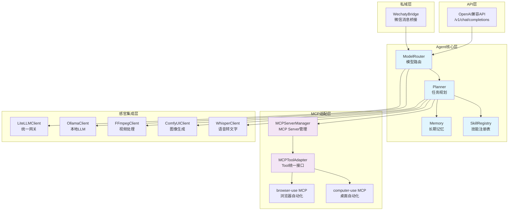
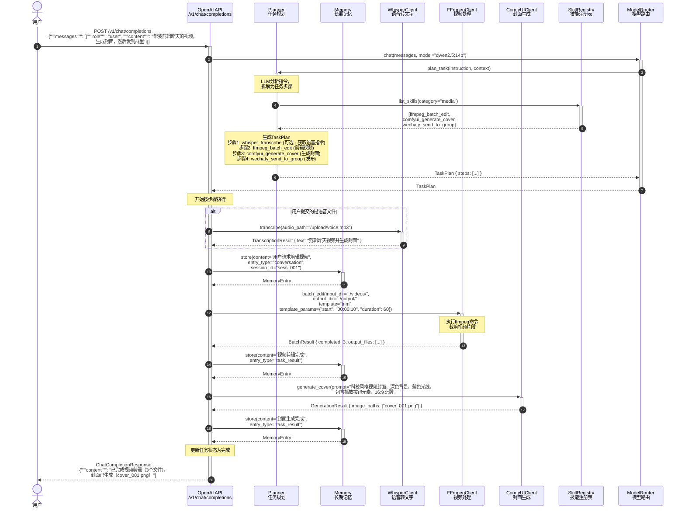
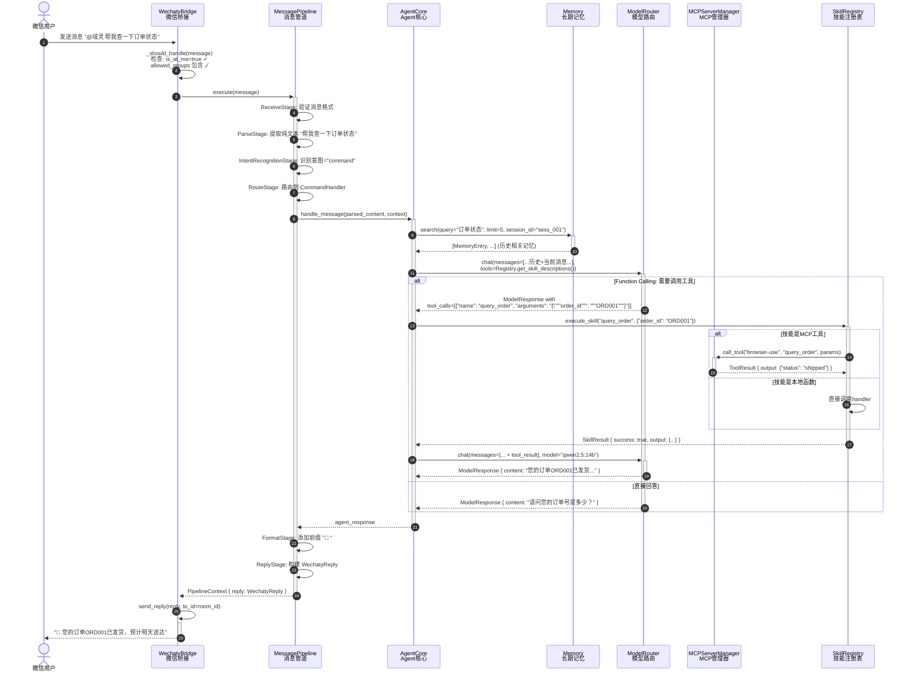
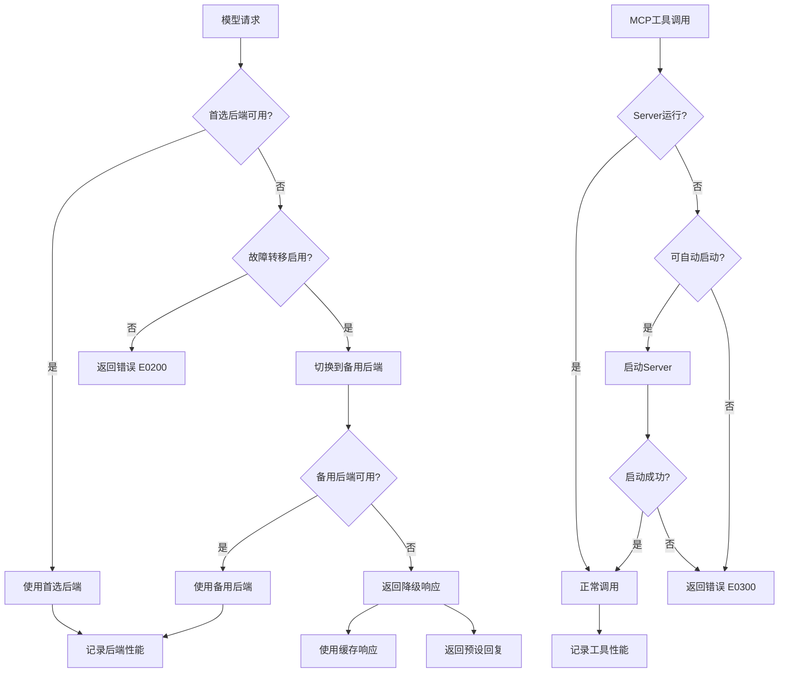

# SPEC.md - 「域灵」数字员工系统项目规格文档

> **版本**: v1.0.0  
> **作者**: AI Architect  
> **最后更新**: 2025-01-XX  
> **状态**: 可执行规格（Ready for Implementation）

> ## ⚠️ Implementation Sync Note (2026-06-10)
>
> This SPEC describes the **original design** of the 域灵 (YuLing) system. The
> actual implementation has diverged in several ways:
>
> | Aspect | SPEC (this doc) | Implementation |
> |--------|-----------------|----------------|
> | **Package name** | `yuling` | `szyg` (`server/szyg/`) |
> | **Config class** | `YuLingSettings` | `SzygSettings` |
> | **Base exception** | `YuLingError` | `SzygError` |
> | **AI kernel** | Planner + SkillRegistry (custom) | Hermes Agent v0.15 (embedded in `server/`) |
> | **LLM backends** | Ollama + LiteLLM | + OpenRouter, ModelScope, Volcano Engine (ARK) |
> | **Image gen** | ComfyUI only | + ModelScope (Z-Image-Turbo), Volcano (Seedream) |
> | **TTS** | Not specified | edge-tts, Volcano Engine TTS |
> | **API routes** | 3 endpoints (/v1/chat, /v1/models, /health) | 61 endpoints (14 route modules) |
> | **Config format** | Nested Pydantic models | Flat YAML with named provider sections |
> | **Business modules** | Not in SPEC | Publisher, Scheduler, Comment Engine, Agents, Hub, OEM, Announce |
>
> **Missing from implementation** (vs SPEC):
> - `transports.py` (StdioTransport, SSETransport) — not implemented
> - `signal_handler.py` — not implemented
> - `container.py` (dependency-injector DI) — not implemented
>
> See `extracted/DEPRECATED.md` for more context on the migration from YuLing → szyg.

---

## 目录

1. [项目概述](#1-项目概述)
2. [模块规格](#2-模块规格)
   - 2.1 Config模块
   - 2.2 Agent Core模块
   - 2.3 MCP适配层
   - 2.4 组件集成接口
   - 2.5 OpenAI兼容API
   - 2.6 私域层
   - 2.7 主应用
3. [数据模型](#3-数据模型)
4. [数据流规格](#4-数据流规格)
5. [错误处理策略](#5-错误处理策略)
6. [配置示例](#6-配置示例)
7. [接口契约汇总表](#7-接口契约汇总表)

---

## 1. 项目概述

### 1.1 项目信息

| 属性 | 值 |
|------|-----|
| **项目名称** | 域灵 (YuLing) → 已重命名为 szyg (智能矩阵运营系统) |
| **项目代号** | szyg (原 yuling) |
| **版本** | 1.0.0 |
| **Python版本要求** | >= 3.11 |
| **架构风格** | 模块化分层架构 + 依赖注入 |
| **通信协议** | MCP (Model Context Protocol) + HTTP REST API |

### 1.2 系统架构总览



### 1.3 项目目录结构

```
yuling/
├── pyproject.toml                 # 项目配置与依赖
├── README.md
├── config.yaml                    # 主配置文件（可被环境变量覆盖）
├── .env.example                   # 环境变量模板
├──
├── yuling/                        # 主包
│   ├── __init__.py                # 包初始化，暴露版本号
│   ├── version.py                 # VERSION = "1.0.0"
│   ├── main.py                    # 应用入口，生命周期管理
│   ├── container.py               # 依赖注入容器
│   │
│   ├── config/                    # 配置模块
│   │   ├── __init__.py
│   │   ├── settings.py            # Pydantic Settings类定义
│   │   ├── loader.py              # 配置加载器（YAML + env）
│   │   └── schemas.py             # 配置子结构Pydantic模型
│   │
│   ├── agent_core/                # 大脑层 - Agent核心
│   │   ├── __init__.py
│   │   ├── planner.py             # 任务规划器
│   │   ├── memory.py              # 长期记忆管理
│   │   ├── skill_registry.py      # 技能注册表
│   │   └── model_router.py        # 模型路由器
│   │
│   ├── models/                    # 共享数据模型（Pydantic）
│   │   ├── __init__.py
│   │   ├── task.py                # TaskPlan/TaskStep
│   │   ├── memory.py              # MemoryEntry
│   │   ├── skill.py               # Skill/SkillResult
│   │   ├── model.py               # ModelResponse
│   │   ├── mcp.py                 # MCPServerConfig/Tool/ToolResult
│   │   ├── integration.py         # 各集成Client的Result模型
│   │   ├── api.py                 # ChatCompletionRequest/Response
│   │   ├── wechaty.py             # WechatyMessage
│   │   └── common.py              # 通用模型（ErrorResponse等）
│   │
│   ├── mcp/                       # 手脚层 - MCP适配
│   │   ├── __init__.py
│   │   ├── server_manager.py      # MCPServerManager
│   │   ├── tool_adapter.py        # MCPToolAdapter
│   │   └── transports.py          # MCP传输层封装（stdio/sse）
│   │
│   ├── integrations/              # 感官层 - 组件集成
│   │   ├── __init__.py
│   │   ├── whisper_client.py      # Whisper语音转文字
│   │   ├── comfyui_client.py      # ComfyUI图像生成
│   │   ├── ffmpeg_client.py       # FFmpeg视频处理
│   │   ├── ollama_client.py       # Ollama本地LLM
│   │   └── litellm_client.py      # LiteLLM统一网关
│   │
│   ├── api/                       # 交互层 - REST API
│   │   ├── __init__.py
│   │   ├── app.py                 # FastAPI应用工厂
│   │   ├── routes.py              # API路由注册
│   │   ├── chat.py                # /v1/chat/completions 端点
│   │   ├── models_endpoint.py     # /v1/models 端点
│   │   └── middleware.py          # 中间件（日志、错误处理）
│   │
│   ├── wechaty/                   # 私域层 - 微信桥接
│   │   ├── __init__.py
│   │   ├── bridge.py              # WechatyBridge
│   │   ├── pipeline.py            # MessagePipeline
│   │   └── handlers.py            # 消息处理器集合
│   │
│   └── infrastructure/            # 基础设施
│       ├── __init__.py
│       ├── database.py            # SQLite连接管理
│       ├── http_client.py         # 共享HTTP Client（httpx）
│       ├── logger.py              # 结构化日志配置（structlog）
│       └── signal_handler.py      # 信号处理（优雅关闭）
│
├── tests/                         # 测试目录
│   ├── __init__.py
│   ├── conftest.py                # pytest fixtures
│   ├── unit/                      # 单元测试
│   │   ├── test_config.py
│   │   ├── test_planner.py
│   │   ├── test_memory.py
│   │   ├── test_skill_registry.py
│   │   ├── test_model_router.py
│   │   ├── test_mcp_manager.py
│   │   ├── test_whisper_client.py
│   │   ├── test_comfyui_client.py
│   │   ├── test_ffmpeg_client.py
│   │   ├── test_ollama_client.py
│   │   ├── test_litellm_client.py
│   │   └── test_api.py
│   ├── integration/               # 集成测试
│   │   ├── test_agent_pipeline.py
│   │   └── test_mcp_integration.py
│   └── fixtures/                  # 测试数据
│       ├── sample_config.yaml
│       ├── sample_task_plan.json
│       └── sample_chat_request.json
│
├── docs/                          # 文档
│   ├── architecture.md
│   ├── deployment.md
│   └── api_reference.md
│
├── scripts/                       # 运维脚本
│   ├── setup.sh                   # 初始化脚本
│   └── start.sh                   # 启动脚本
│
└── data/                          # 运行时数据（.gitignore）
    ├── memory.db                  # SQLite记忆库
    ├── skills/                    # 技能模板文件
    └── cache/                     # 临时缓存
```

### 1.4 技术栈版本

| 组件 | 包名 | 版本 | 用途 |
|------|------|------|------|
| Web框架 | `fastapi` | ^0.115.0 | REST API |
| ASGI服务器 | `uvicorn[standard]` | ^0.32.0 | 服务运行 |
| HTTP客户端 | `httpx` | ^0.27.0 | 外部API调用 |
| 配置管理 | `pydantic-settings` | ^2.6.0 | 配置验证 |
| 依赖注入 | `dependency-injector` | ^4.42.0 | DI容器 |
| 结构化日志 | `structlog` | ^24.4.0 | 日志处理 |
| MCP协议 | `mcp` | ^1.0.0 | MCP通信 |
| 微信桥接 | `wechaty` | ^0.10.7 | 微信Bot |
| 语音处理 | `openai-whisper` | ^20240930 | 语音转文字 |
| 向量数据库 | `chromadb` | ^0.5.0 | 向量存储（可选） |
| 数据验证 | `pydantic` | ^2.9.0 | 模型验证 |
| 测试框架 | `pytest` | ^8.3.0 | 单元测试 |
| 测试插件 | `pytest-asyncio` | ^0.24.0 | 异步测试 |
| 覆盖率 | `pytest-cov` | ^5.0.0 | 测试覆盖 |
| 代码质量 | `ruff` | ^0.7.0 | 代码检查 |

---

## 2. 模块规格

### 2.1 Config模块 (`yuling/config/`)

#### 2.1.1 设计原则

- **分层加载优先级**（高优先级覆盖低优先级）：
  1. 代码中的 `default` 默认值
  2. `config.yaml` 配置文件
  3. 环境变量（前缀 `YL_`）
  4. 运行时传入的参数

- **配置热加载**: `config.yaml` 变更时可通过 `/health/reload` 触发重新加载

#### 2.1.2 Pydantic模型

##### `YuLingSettings` - 根配置类

```python
class YuLingSettings(BaseSettings):
    """域灵系统根配置类"""

    model_config = SettingsConfigDict(
        env_prefix="YL_",           # 环境变量前缀
        env_nested_class_separator="__",  # YL_AGENT__NAME
        yaml_file="config.yaml",
        case_sensitive=False,
        extra="ignore",
    )

    # === 子配置引用 ===
    agent: AgentConfig
    memory: MemoryConfig
    mcp_servers: MCPConfig
    models: ModelsConfig
    integrations: IntegrationsConfig
    api: APIConfig
    wechaty: WechatyConfig

    # === 全局设置 ===
    debug: bool = Field(default=False, description="调试模式")
    log_level: Literal["DEBUG", "INFO", "WARNING", "ERROR"] = Field(
        default="INFO", description="日志级别"
    )
    data_dir: Path = Field(
        default=Path("./data"), description="数据存储目录"
    )
```

##### `AgentConfig` - Agent配置

```python
class AgentConfig(BaseModel):
    """Agent核心配置"""
    name: str = Field(default="域灵", description="Agent显示名称")
    max_plan_steps: int = Field(
        default=10, ge=1, le=50,
        description="最大规划步骤数"
    )
    planner_model: str = Field(
        default="qwen2.5:14b",
        description="任务规划使用的模型"
    )
    executor_model: str = Field(
        default="qwen2.5:14b",
        description="步骤执行使用的模型"
    )
    max_retries: int = Field(
        default=3, ge=0, le=10,
        description="单步骤最大重试次数"
    )
    timeout_seconds: int = Field(
        default=120, ge=10,
        description="单步骤超时时间（秒）"
    )
    enable_self_correction: bool = Field(
        default=True,
        description="启用自我纠错"
    )
```

##### `MemoryConfig` - 记忆配置

```python
class MemoryConfig(BaseModel):
    """长期记忆配置"""
    db_path: str = Field(
        default="./data/memory.db",
        description="SQLite数据库路径"
    )
    enable_fts: bool = Field(
        default=True,
        description="启用FTS5全文检索"
    )
    embedding_dim: int = Field(
        default=768, ge=128, le=4096,
        description="向量维度"
    )
    similarity_threshold: float = Field(
        default=0.75, ge=0.0, le=1.0,
        description="相似度检索阈值"
    )
    max_history_per_session: int = Field(
        default=20, ge=5,
        description="每会话最大历史条数"
    )
    auto_summarize_after: int = Field(
        default=10, ge=5,
        description="超过此条数自动摘要"
    )
```

##### `MCPConfig` - MCP服务器配置

```python
class MCPServerDefinition(BaseModel):
    """单个MCP服务器定义"""
    name: str = Field(description="服务器标识名")
    command: str = Field(description="启动命令（如 uvx, npx）")
    args: list[str] = Field(default_factory=list, description="命令参数")
    env: dict[str, str] = Field(
        default_factory=dict, description="环境变量"
    )
    enabled: bool = Field(default=True, description="是否启用")
    auto_start: bool = Field(default=True, description="随系统启动")
    timeout: int = Field(
        default=30, ge=5,
        description="工具调用超时（秒）"
    )

class MCPConfig(BaseModel):
    """MCP服务器总配置"""
    servers: list[MCPServerDefinition] = Field(
        default_factory=list,
        description="MCP服务器列表"
    )
    default_timeout: int = Field(
        default=30, ge=5,
        description="默认超时（秒）"
    )
    tool_result_max_length: int = Field(
        default=10000, ge=1000,
        description="工具结果最大长度"
    )
```

##### `ModelsConfig` - 模型配置

```python
class ModelBackend(BaseModel):
    """模型后端配置"""
    name: str = Field(description="后端标识名")
    backend_type: Literal["ollama", "litellm"] = Field(
        description="后端类型"
    )
    base_url: str = Field(description="API基础URL")
    api_key: str | None = Field(
        default=None, description="API密钥（云端模型需要）"
    )
    default_model: str = Field(description="默认模型名")
    available_models: list[str] = Field(
        default_factory=list,
        description="可用模型列表"
    )
    timeout: int = Field(default=60, ge=10)
    max_tokens: int = Field(default=4096, ge=256)
    priority: int = Field(
        default=1, ge=1, le=10,
        description="优先级（1最高）"
    )
    enable_streaming: bool = Field(default=True)

class ModelsConfig(BaseModel):
    """模型路由总配置"""
    backends: list[ModelBackend] = Field(
        default_factory=list,
        description="模型后端列表"
    )
    default_backend: str = Field(
        default="ollama", description="默认后端"
    )
    fallback_enabled: bool = Field(
        default=True, description="启用故障转移"
    )
    fallback_order: list[str] = Field(
        default_factory=list,
        description="故障转移顺序"
    )
    request_timeout: int = Field(default=120, ge=10)
```

##### `IntegrationsConfig` - 集成组件配置

```python
class WhisperConfig(BaseModel):
    """Whisper配置"""
    api_url: str = Field(default="http://localhost:9000")
    default_model: str = Field(default="medium")
    default_language: str = Field(default="zh")
    timeout: int = Field(default=300, ge=10)

class ComfyUIConfig(BaseModel):
    """ComfyUI配置"""
    api_url: str = Field(default="http://localhost:8188")
    output_dir: str = Field(default="./data/comfyui_output")
    default_workflow: str = Field(default="default")
    timeout: int = Field(default=300, ge=10)

class FFmpegConfig(BaseModel):
    """FFmpeg配置"""
    ffmpeg_path: str = Field(default="ffmpeg")
    ffprobe_path: str = Field(default="ffprobe")
    default_video_codec: str = Field(default="libx264")
    default_audio_codec: str = Field(default="aac")
    threads: int = Field(default=4, ge=1, le=16)
    hwaccel: str | None = Field(
        default=None, description="硬件加速（如 cuda, vaapi）"
    )
    templates_dir: str = Field(default="./data/ffmpeg_templates")

class IntegrationsConfig(BaseModel):
    """集成组件总配置"""
    whisper: WhisperConfig = Field(default_factory=WhisperConfig)
    comfyui: ComfyUIConfig = Field(default_factory=ComfyUIConfig)
    ffmpeg: FFmpegConfig = Field(default_factory=FFmpegConfig)
```

##### `APIConfig` - API服务配置

```python
class APIConfig(BaseModel):
    """API服务配置"""
    host: str = Field(default="0.0.0.0")
    port: int = Field(default=8000, ge=1024, le=65535)
    workers: int = Field(default=1, ge=1, le=8)
    reload: bool = Field(default=False, description="开发热重载")
    cors_origins: list[str] = Field(
        default_factory=list,
        description="CORS允许来源"
    )
    api_key: str | None = Field(
        default=None, description="API访问密钥（None表示不校验）"
    )
    request_timeout: int = Field(default=120, ge=10)
    max_request_body_size: int = Field(
        default=10485760, ge=1048576,
        description="最大请求体大小（字节，默认10MB）"
    )
    enable_docs: bool = Field(
        default=True, description="启用Swagger文档"
    )
```

##### `WechatyConfig` - 微信配置

```python
class WechatyConfig(BaseModel):
    """微信桥接配置"""
    enabled: bool = Field(default=False)
    name: str = Field(default="域灵助手")
    puppet: str = Field(default="wechaty-puppet-wechat")
    token: str | None = Field(default=None)
    endpoint: str | None = Field(default=None)
    auto_accept_friend: bool = Field(default=False)
    allowed_groups: list[str] = Field(
        default_factory=list,
        description="允许交互的群名称（空列表表示全部）"
    )
    admin_users: list[str] = Field(
        default_factory=list,
        description="管理员wxid列表"
    )
    response_prefix: str = Field(
        default="🤖 ", description="回复消息前缀"
    )
    max_message_length: int = Field(
        default=2000, ge=100,
        description="单条消息最大长度"
    )
    enable_at_reply: bool = Field(
        default=True, description="群聊中仅@时回复"
    )
    cooldown_seconds: int = Field(
        default=1, ge=0,
        description="冷却时间（秒）"
    )
```

#### 2.1.3 配置加载器 `loader.py`

```python
class ConfigLoader:
    """
    配置加载器：负责分层加载配置

    加载优先级（高到低）：
    1. 运行时参数
    2. 环境变量（YL_*）
    3. config.yaml
    4. 代码默认值

    Usage:
        loader = ConfigLoader(config_path="config.yaml")
        settings = loader.load()
    """

    def __init__(self, config_path: str | Path = "config.yaml") -> None:
        """初始化加载器

        Args:
            config_path: YAML配置文件路径
        """
        ...

    def load(self) -> YuLingSettings:
        """加载并返回完整配置

        Returns:
            YuLingSettings: 验证后的配置对象

        Raises:
            ConfigValidationError: 配置验证失败
            ConfigFileNotFoundError: 配置文件不存在（仅当文件被显式指定时）
        """
        ...

    def reload(self) -> YuLingSettings:
        """重新加载配置（热更新）

        Returns:
            YuLingSettings: 新的配置对象
        """
        ...

    def get_raw_yaml(self) -> dict[str, Any]:
        """获取原始YAML字典（用于调试）

        Returns:
            dict: 原始配置字典
        """
        ...
```

#### 2.1.4 配置验证规则

| 规则ID | 规则描述 | 验证方式 | 失败行为 |
|--------|----------|----------|----------|
| C001 | `agent.max_plan_steps` 在 1-50 之间 | Pydantic Field(ge,le) | ValidationError |
| C002 | `memory.similarity_threshold` 在 0.0-1.0 之间 | Pydantic Field(ge,le) | ValidationError |
| C003 | `api.port` 在 1024-65535 之间 | Pydantic Field(ge,le) | ValidationError |
| C004 | `models.backends` 至少有一个后端 | 自定义验证器 @field_validator | ValidationError |
| C005 | `models.default_backend` 必须在 backends 中存在 | 自定义验证器 @field_validator | ValidationError |
| C006 | `mcp_servers.servers` 中的 name 必须唯一 | 自定义验证器 @field_validator | ValidationError |
| C007 | `wechaty.cooldown_seconds` 非负 | Pydantic Field(ge) | ValidationError |
| C008 | `memory.db_path` 所在目录必须可写 | 运行时检查 os.access | Warning日志 |

---

### 2.2 Agent Core模块 (`yuling/agent_core/`)

#### 2.2.1 Planner 任务规划器 (`planner.py`)

##### 职责
- 接收自然语言指令，生成结构化任务计划
- 支持自纠错：执行失败时重新规划
- 支持增量规划：复杂任务分阶段规划

##### Pydantic模型

```python
class TaskStep(BaseModel):
    """单个任务步骤"""
    step_id: str = Field(description="步骤唯一ID（如 step_001）")
    step_number: int = Field(ge=1, description="步骤序号")
    description: str = Field(description="人类可读的步骤描述")
    tool_name: str = Field(description="要调用的工具/技能名")
    parameters: dict[str, Any] = Field(
        default_factory=dict, description="工具参数"
    )
    dependencies: list[str] = Field(
        default_factory=list,
        description="依赖的前置步骤ID"
    )
    expected_output: str | None = Field(
        default=None, description="预期输出描述"
    )
    retry_count: int = Field(
        default=0, ge=0, description="已重试次数"
    )
    timeout_seconds: int | None = Field(
        default=None, description="步骤超时（覆盖全局）"
    )
    is_critical: bool = Field(
        default=False,
        description="是否关键步骤（失败则整体失败）"
    )

class TaskPlan(BaseModel):
    """完整任务计划"""
    plan_id: str = Field(description="计划唯一ID（UUID）")
    original_instruction: str = Field(description="原始自然语言指令")
    created_at: datetime = Field(default_factory=datetime.utcnow)
    status: Literal["pending", "in_progress", "completed", "failed", "cancelled"] = Field(
        default="pending"
    )
    steps: list[TaskStep] = Field(
        default_factory=list, description="步骤列表"
    )
    current_step_index: int = Field(
        default=0, ge=0, description="当前执行步骤索引"
    )
    metadata: dict[str, Any] = Field(
        default_factory=dict,
        description="额外元数据（如用户ID、会话ID等）"
    )

    @property
    def is_complete(self) -> bool:
        """所有步骤是否已完成"""
        return all(s.status == "completed" for s in self.steps)

    @property
    def progress(self) -> float:
        """完成进度 0.0-1.0"""
        if not self.steps:
            return 0.0
        completed = sum(1 for s in self.steps if s.status == "completed")
        return completed / len(self.steps)
```

##### 类定义

```python
class Planner:
    """
    任务规划器

    使用LLM将自然语言指令拆解为结构化任务计划。
    规划Prompt模板内嵌于类中，可通过配置文件覆盖。
    """

    def __init__(
        self,
        model_router: ModelRouter,
        skill_registry: SkillRegistry,
        max_steps: int = 10,
        enable_self_correction: bool = True,
    ) -> None:
        """初始化规划器

        Args:
            model_router: 模型路由器实例
            skill_registry: 技能注册表实例（用于获取可用工具列表）
            max_steps: 最大规划步骤数
            enable_self_correction: 是否启用自纠错
        """
        ...

    async def plan_task(
        self,
        instruction: str,
        context: dict[str, Any] | None = None,
        existing_plan: TaskPlan | None = None,
    ) -> TaskPlan:
        """
        将自然语言指令拆解为任务计划

        Args:
            instruction: 自然语言指令（如"帮我剪辑昨天录制的视频并生成封面"）
            context: 上下文信息（会话历史、用户信息等）
            existing_plan: 现有计划（用于增量规划/重新规划）

        Returns:
            TaskPlan: 结构化的任务计划

        Raises:
            PlanningError: 规划失败（LLM无法生成有效计划）
            TaskTooComplexError: 任务过于复杂（超出max_steps限制）

        Example:
            >>> planner = Planner(model_router, skill_registry)
            >>> plan = await planner.plan_task(
            ...     "剪辑视频并添加字幕",
            ...     context={"session_id": "sess_001"}
            ... )
            >>> print(plan.steps[0].tool_name)
            'ffmpeg_batch_edit'
        """
        ...

    async def replan_on_failure(
        self,
        plan: TaskPlan,
        failed_step: TaskStep,
        error_message: str,
    ) -> TaskPlan:
        """
        步骤执行失败时重新规划

        Args:
            plan: 当前任务计划
            failed_step: 失败的步骤
            error_message: 错误信息

        Returns:
            TaskPlan: 更新后的任务计划（可能包含替代步骤）

        Raises:
            ReplanningError: 重新规划失败
        """
        ...

    async def plan_incremental(
        self,
        instruction: str,
        completed_steps: list[TaskStep],
        remaining_goal: str,
    ) -> TaskPlan:
        """
        增量规划：基于已完成步骤规划剩余任务

        Args:
            instruction: 原始指令
            completed_steps: 已完成的步骤
            remaining_goal: 剩余目标描述

        Returns:
            TaskPlan: 新的增量计划
        """
        ...

    def _build_planning_prompt(
        self,
        instruction: str,
        available_skills: list[Skill],
        context: dict[str, Any] | None = None,
    ) -> str:
        """构建规划Prompt（内部方法）"""
        ...
```

#### 2.2.2 Memory 长期记忆 (`memory.py`)

##### 职责
- 存储和检索长期记忆
- SQLite FTS5全文检索
- 基于简单向量相似度的语义检索（可选，若chromadb可用）
- 会话历史管理

##### Pydantic模型

```python
class MemoryEntry(BaseModel):
    """单条记忆条目"""
    entry_id: str = Field(description="记忆唯一ID（UUID）")
    content: str = Field(description="记忆内容文本")
    entry_type: Literal["fact", "conversation", "task_result", "skill_usage"] = Field(
        default="fact", description="记忆类型"
    )
    source: str | None = Field(
        default=None, description="来源（如任务ID、会话ID）"
    )
    metadata: dict[str, Any] = Field(
        default_factory=dict,
        description="额外元数据"
    )
    created_at: datetime = Field(default_factory=datetime.utcnow)
    updated_at: datetime = Field(default_factory=datetime.utcnow)
    access_count: int = Field(
        default=0, ge=0, description="访问次数"
    )
    relevance_score: float | None = Field(
        default=None, description="检索时的相关度分数"
    )
    session_id: str | None = Field(
        default=None, description="关联会话ID"
    )

    # 用于SQLite FTS的虚拟字段（不存储）
    fts_content: str | None = Field(
        default=None, exclude=True,
        description="FTS索引内容（由系统生成）"
    )
```

##### 类定义

```python
class MemoryManager:
    """
    长期记忆管理器

    基于SQLite + FTS5实现全文检索，可选ChromaDB做向量检索。
    所有操作线程安全（通过 asyncio.Lock 实现）。
    """

    def __init__(
        self,
        db_path: str | Path = "./data/memory.db",
        embedding_dim: int = 768,
        similarity_threshold: float = 0.75,
        enable_fts: bool = True,
    ) -> None:
        """初始化记忆管理器

        Args:
            db_path: SQLite数据库路径
            embedding_dim: 向量维度（用于向量检索）
            similarity_threshold: 相似度阈值
            enable_fts: 是否启用FTS5全文检索
        """
        ...

    async def initialize(self) -> None:
        """异步初始化数据库表和FTS索引

        Raises:
            DatabaseError: 数据库初始化失败
        """
        ...

    async def store(
        self,
        content: str,
        entry_type: Literal["fact", "conversation", "task_result", "skill_usage"] = "fact",
        metadata: dict[str, Any] | None = None,
        source: str | None = None,
        session_id: str | None = None,
    ) -> MemoryEntry:
        """
        存储一条记忆

        Args:
            content: 记忆内容文本
            entry_type: 记忆类型
            metadata: 额外元数据
            source: 来源标识
            session_id: 关联会话ID

        Returns:
            MemoryEntry: 存储后的记忆条目

        Raises:
            StorageError: 存储失败
            ValueError: content为空或过长（>10000字符）
        """
        ...

    async def search(
        self,
        query: str,
        limit: int = 5,
        entry_type: Literal["fact", "conversation", "task_result", "skill_usage"] | None = None,
        session_id: str | None = None,
        min_relevance: float | None = None,
    ) -> list[MemoryEntry]:
        """
        全文检索记忆

        Args:
            query: 检索关键词
            limit: 返回结果数量上限
            entry_type: 按类型过滤
            session_id: 按会话过滤
            min_relevance: 最小相关度分数

        Returns:
            list[MemoryEntry]: 相关记忆列表（按相关度排序）

        Raises:
            SearchError: 检索失败
        """
        ...

    async def semantic_search(
        self,
        query: str,
        limit: int = 5,
        embedding: list[float] | None = None,
    ) -> list[MemoryEntry]:
        """
        语义相似度检索（需要ChromaDB支持）

        Args:
            query: 查询文本（如未提供embedding则使用文本）
            limit: 返回结果数量上限
            embedding: 预计算的查询向量（可选）

        Returns:
            list[MemoryEntry]: 语义相关的记忆列表

        Raises:
            NotAvailableError: ChromaDB不可用
            SearchError: 检索失败
        """
        ...

    async def get_by_id(self, entry_id: str) -> MemoryEntry | None:
        """根据ID获取记忆

        Args:
            entry_id: 记忆ID

        Returns:
            MemoryEntry | None: 记忆条目或None
        """
        ...

    async def delete(self, entry_id: str) -> bool:
        """删除记忆

        Args:
            entry_id: 记忆ID

        Returns:
            bool: 是否成功删除
        """
        ...

    async def update(
        self,
        entry_id: str,
        content: str | None = None,
        metadata: dict[str, Any] | None = None,
    ) -> MemoryEntry | None:
        """更新记忆内容或元数据

        Args:
            entry_id: 记忆ID
            content: 新内容（None则不更新）
            metadata: 要合并的元数据

        Returns:
            MemoryEntry | None: 更新后的条目或None
        """
        ...

    async def get_session_history(
        self,
        session_id: str,
        limit: int = 20,
    ) -> list[MemoryEntry]:
        """获取会话历史

        Args:
            session_id: 会话ID
            limit: 最大返回条数

        Returns:
            list[MemoryEntry]: 按时间倒序排列的历史记录
        """
        ...

    async def store_session_message(
        self,
        session_id: str,
        role: Literal["user", "assistant", "system"],
        content: str,
    ) -> MemoryEntry:
        """
        存储会话消息

        Args:
            session_id: 会话ID
            role: 消息角色
            content: 消息内容

        Returns:
            MemoryEntry: 存储的记忆条目
        """
        ...

    async def summarize_session(
        self,
        session_id: str,
        model_router: ModelRouter | None = None,
    ) -> MemoryEntry:
        """
        对会话进行摘要并存储

        Args:
            session_id: 会话ID
            model_router: 模型路由器（用于生成摘要）

        Returns:
            MemoryEntry: 摘要记忆条目
        """
        ...

    async def close(self) -> None:
        """关闭数据库连接"""
        ...
```

#### 2.2.3 SkillRegistry 技能注册表 (`skill_registry.py`)

##### 职责
- 注册和管理可复用的技能模板
- 提供统一的技能调用接口
- 支持动态加载技能（从Python模块或配置文件）

##### Pydantic模型

```python
class SkillParameter(BaseModel):
    """技能参数定义"""
    name: str = Field(description="参数名")
    description: str = Field(description="参数描述")
    param_type: Literal["string", "integer", "float", "boolean", "array", "object", "file_path"] = Field(
        description="参数数据类型"
    )
    required: bool = Field(default=True, description="是否必需")
    default: Any | None = Field(
        default=None, description="默认值"
    )
    enum: list[Any] | None = Field(
        default=None, description="枚举值列表"
    )

class Skill(BaseModel):
    """技能定义"""
    name: str = Field(description="技能唯一标识名")
    display_name: str = Field(description="人类可读的技能名")
    description: str = Field(description="技能功能描述（给LLM看的）")
    parameters: list[SkillParameter] = Field(
        default_factory=list, description="参数定义列表"
    )
    category: Literal["media", "file", "web", "system", "communication"] = Field(
        default="system", description="技能分类"
    )
    is_internal: bool = Field(
        default=False, description="是否为内部技能（不暴露给LLM）"
    )
    timeout_seconds: int | None = Field(
        default=None, description="执行超时"
    )
    tags: list[str] = Field(
        default_factory=list, description="技能标签"
    )
    example_usage: str | None = Field(
        default=None, description="使用示例"
    )
    handler_ref: str | None = Field(
        default=None,
        description="处理函数引用路径（如 yuling.skills.ffmpeg:batch_edit）",
        exclude=True,  # 不序列化
    )

class SkillResult(BaseModel):
    """技能执行结果"""
    success: bool = Field(description="是否成功")
    skill_name: str = Field(description="执行的技能名")
    output: Any = Field(
        default=None, description="输出结果（任意类型）"
    )
    error_message: str | None = Field(
        default=None, description="错误信息（失败时）"
    )
    execution_time_ms: int = Field(
        default=0, ge=0, description="执行耗时（毫秒）"
    )
    metadata: dict[str, Any] = Field(
        default_factory=dict,
        description="执行元数据"
    )
    created_at: datetime = Field(default_factory=datetime.utcnow)
```

##### 类定义

```python
class SkillRegistry:
    """
    技能注册表

    提供技能的注册、发现、执行功能。
    支持从Python函数注册和从配置文件批量加载。
    """

    def __init__(self) -> None:
        """初始化空注册表"""
        ...

    def register_skill(
        self,
        skill: Skill,
        handler: Callable[..., Any] | None = None,
    ) -> None:
        """
        注册单个技能

        Args:
            skill: 技能定义（Pydantic模型）
            handler: 处理函数（同步或异步均可）

        Raises:
            DuplicateSkillError: 技能名已存在
            InvalidHandlerError: handler签名不匹配

        Example:
            >>> registry = SkillRegistry()
            >>> skill = Skill(
            ...     name="ffmpeg_extract_audio",
            ...     display_name="提取音频",
            ...     description="从视频中提取音频轨道",
            ...     parameters=[
            ...         SkillParameter(name="video_path", description="视频文件路径", param_type="file_path")
            ...     ],
            ...     category="media",
            ... )
            >>> registry.register_skill(skill, handler=extract_audio_func)
        """
        ...

    def register_from_function(
        self,
        func: Callable[..., Any],
        name: str | None = None,
        description: str | None = None,
        category: str = "system",
    ) -> Skill:
        """
        从Python函数自动注册技能（通过类型注解推断参数）

        Args:
            func: 处理函数
            name: 技能名（默认使用函数名）
            description: 描述（默认使用docstring）
            category: 分类

        Returns:
            Skill: 生成的技能定义
        """
        ...

    def unregister_skill(self, name: str) -> bool:
        """注销技能

        Args:
            name: 技能名

        Returns:
            bool: 是否成功（False表示技能不存在）
        """
        ...

    def list_skills(
        self,
        category: str | None = None,
        include_internal: bool = False,
    ) -> list[Skill]:
        """
        列出已注册的技能

        Args:
            category: 按分类过滤（None表示全部）
            include_internal: 是否包含内部技能

        Returns:
            list[Skill]: 技能列表
        """
        ...

    def get_skill(self, name: str) -> Skill | None:
        """获取技能定义

        Args:
            name: 技能名

        Returns:
            Skill | None: 技能定义或None
        """
        ...

    async def execute_skill(
        self,
        name: str,
        parameters: dict[str, Any],
        timeout: int | None = None,
    ) -> SkillResult:
        """
        执行技能

        Args:
            name: 技能名
            parameters: 参数字典
            timeout: 执行超时（覆盖技能定义中的超时）

        Returns:
            SkillResult: 执行结果

        Raises:
            SkillNotFoundError: 技能不存在
            SkillExecutionError: 执行过程中出错
            SkillTimeoutError: 执行超时
        """
        ...

    def load_from_config(self, config_path: str | Path) -> int:
        """
        从配置文件批量加载技能定义

        Args:
            config_path: YAML技能配置文件路径

        Returns:
            int: 加载的技能数量

        Raises:
            ConfigLoadError: 配置文件加载失败
        """
        ...

    def get_skill_descriptions_for_llm(self) -> str:
        """
        生成给LLM的工具描述文本

        Returns:
            str: 格式化的工具描述（JSON Schema风格）
        """
        ...
```

#### 2.2.4 ModelRouter 模型路由器 (`model_router.py`)

##### 职责
- 根据请求路由到正确的模型后端
- 支持故障转移（Ollama → LiteLLM）
- 统一输入输出格式
- 管理模型可用性

##### Pydantic模型

```python
class ChatMessage(BaseModel):
    """聊天消息（OpenAI兼容格式）"""
    role: Literal["system", "user", "assistant", "tool"] = Field(
        description="消息角色"
    )
    content: str = Field(description="消息内容")
    name: str | None = Field(
        default=None, description="角色名称（用于function calling）"
    )
    tool_calls: list[dict[str, Any]] | None = Field(
        default=None, description="工具调用"
    )
    tool_call_id: str | None = Field(
        default=None, description="工具调用ID"
    )

class ModelResponse(BaseModel):
    """模型响应"""
    response_id: str = Field(description="响应ID（UUID）")
    backend: str = Field(description="使用的后端名")
    model: str = Field(description="使用的模型名")
    content: str = Field(description="生成的内容")
    finish_reason: Literal["stop", "length", "tool_calls", "error"] = Field(
        default="stop"
    )
    usage: dict[str, int] = Field(
        default_factory=lambda: {"prompt_tokens": 0, "completion_tokens": 0, "total_tokens": 0}
    )
    created_at: datetime = Field(default_factory=datetime.utcnow)
    raw_response: dict[str, Any] | None = Field(
        default=None, exclude=True,
        description="原始响应（调试用）"
    )

class ModelInfo(BaseModel):
    """模型信息"""
    id: str = Field(description="模型ID")
    backend: str = Field(description="所属后端")
    display_name: str = Field(description="显示名称")
    context_length: int = Field(description="上下文长度")
    capabilities: list[Literal["chat", "vision", "function_calling", "embeddings"]] = Field(
        default_factory=list
    )
    is_available: bool = Field(default=True)
```

##### 类定义

```python
class ModelRouter:
    """
    模型路由器

    统一管理Ollama（本地）和LiteLLM（云端）两种后端。
    自动处理故障转移和重试。
    """

    def __init__(
        self,
        backends: list[ModelBackend],
        default_backend: str = "ollama",
        fallback_enabled: bool = True,
        fallback_order: list[str] | None = None,
        request_timeout: int = 120,
    ) -> None:
        """初始化模型路由器

        Args:
            backends: 模型后端配置列表
            default_backend: 默认后端名
            fallback_enabled: 是否启用故障转移
            fallback_order: 故障转移顺序
            request_timeout: 请求超时（秒）
        """
        ...

    async def chat(
        self,
        messages: list[ChatMessage],
        model: str | None = None,
        backend_preference: str | None = None,
        stream: bool = False,
        temperature: float = 0.7,
        max_tokens: int | None = None,
        tools: list[dict[str, Any]] | None = None,
    ) -> ModelResponse | AsyncIterator[ModelResponse]:
        """
        发送聊天请求

        Args:
            messages: 消息列表
            model: 模型名（None使用后端默认）
            backend_preference: 优先后端
            stream: 是否流式返回
            temperature: 温度参数
            max_tokens: 最大token数
            tools: 可用工具定义（function calling）

        Returns:
            ModelResponse 或 AsyncIterator[ModelResponse]（stream=True时）

        Raises:
            BackendNotAvailableError: 所有后端不可用
            ModelNotFoundError: 指定模型不存在
            RequestTimeoutError: 请求超时
        """
        ...

    async def route_request(
        self,
        messages: list[ChatMessage],
        model_preference: str | None = None,
        backend_preference: str | None = None,
    ) -> ModelResponse:
        """
        路由请求到合适的后端（非流式）

        Args:
            messages: 消息列表
            model_preference: 模型偏好
            backend_preference: 后端偏好

        Returns:
            ModelResponse: 模型响应
        """
        ...

    async def get_available_models(self) -> list[ModelInfo]:
        """
        获取所有可用模型列表

        Returns:
            list[ModelInfo]: 模型信息列表
        """
        ...

    async def health_check(self, backend_name: str | None = None) -> dict[str, bool]:
        """
        健康检查

        Args:
            backend_name: 指定后端（None检查所有）

        Returns:
            dict[backend_name, is_healthy]
        """
        ...

    async def check_backend_availability(self, backend: ModelBackend) -> bool:
        """检查单个后端可用性（内部方法）"""
        ...
```


---

### 2.3 MCP适配层 (`yuling/mcp/`)

#### 2.3.1 设计原则

- **传输层抽象**: 支持 stdio 和 SSE 两种MCP传输协议
- **生命周期管理**: 每个MCP Server独立启动/停止/监控
- **工具统一接口**: 所有MCP工具通过统一接口 `call_tool` 调用
- **资源隔离**: 每个Server进程独立，互不干扰

#### 2.3.2 Pydantic模型

##### `MCPServerConfig` - MCP服务器配置

```python
class MCPServerConfig(BaseModel):
    """MCP服务器运行时配置"""
    name: str = Field(description="服务器唯一标识名")
    command: str = Field(description="启动命令（如 uvx, npx, python）")
    args: list[str] = Field(
        default_factory=list, description="命令行参数"
    )
    env: dict[str, str] = Field(
        default_factory=dict,
        description="额外的环境变量"
    )
    working_dir: str | None = Field(
        default=None, description="工作目录"
    )
    enabled: bool = Field(default=True)
    auto_start: bool = Field(default=True)
    timeout: int = Field(default=30, ge=5, description="工具调用超时（秒）")
    max_restarts: int = Field(
        default=3, ge=0, description="崩溃后最大重启次数"
    )
    restart_interval: int = Field(
        default=5, ge=1, description="重启间隔（秒）"
    )
    status: Literal["stopped", "starting", "running", "crashed", "disabled"] = Field(
        default="stopped"
    )
    pid: int | None = Field(
        default=None, description="进程ID（运行中）"
    )
    last_error: str | None = Field(
        default=None, description="最后错误信息"
    )
    tools: list[Tool] = Field(
        default_factory=list, description="服务器提供的工具列表"
    )
```

##### `Tool` / `ToolResult` - 工具定义与结果

```python
class ToolParameter(BaseModel):
    """工具参数定义（JSON Schema风格）"""
    name: str = Field(description="参数名")
    description: str = Field(description="参数描述")
    type: Literal["string", "integer", "number", "boolean", "array", "object"] = Field(
        description="JSON Schema类型"
    )
    required: bool = Field(default=True)
    default: Any | None = Field(default=None)
    enum: list[Any] | None = Field(default=None)

class Tool(BaseModel):
    """MCP工具定义"""
    name: str = Field(description="工具唯一名（server.tool格式）")
    description: str = Field(description="工具功能描述")
    parameters: list[ToolParameter] = Field(
        default_factory=list, description="参数列表"
    )
    server_name: str = Field(description="所属服务器名")
    is_available: bool = Field(default=True)
    category: str | None = Field(
        default=None, description="工具分类"
    )
    example_input: dict[str, Any] | None = Field(
        default=None, description="示例输入"
    )

class ToolResult(BaseModel):
    """工具调用结果"""
    success: bool = Field(description="是否成功")
    tool_name: str = Field(description="调用的工具名")
    server_name: str = Field(description="调用的服务器名")
    output: str | dict[str, Any] | None = Field(
        default=None, description="输出结果"
    )
    error_message: str | None = Field(
        default=None, description="错误信息"
    )
    execution_time_ms: int = Field(
        default=0, ge=0, description="执行耗时（毫秒）"
    )
    is_truncated: bool = Field(
        default=False,
        description="结果是否被截断"
    )
    created_at: datetime = Field(default_factory=datetime.utcnow)
```

#### 2.3.3 MCPServerManager (`server_manager.py`)

```python
class MCPServerManager:
    """
    MCP服务器管理器

    管理多个MCP Server的生命周期（启动、停止、监控），
    提供统一工具调用接口。
    """

    def __init__(
        self,
        server_configs: list[MCPServerConfig] | None = None,
        default_timeout: int = 30,
        tool_result_max_length: int = 10000,
    ) -> None:
        """初始化MCP服务器管理器

        Args:
            server_configs: 服务器配置列表
            default_timeout: 默认工具调用超时
            tool_result_max_length: 工具结果最大长度
        """
        ...

    async def initialize(self) -> None:
        """初始化：启动所有 auto_start=true 的Server

        Raises:
            MCPInitError: 初始化失败
        """
        ...

    async def add_server(self, config: MCPServerConfig) -> None:
        """
        添加MCP服务器

        Args:
            config: 服务器配置

        Raises:
            DuplicateServerError: 服务器名已存在
            InvalidConfigError: 配置无效
        """
        ...

    async def start_server(self, name: str) -> MCPServerConfig:
        """
        启动指定Server

        Args:
            name: 服务器名

        Returns:
            MCPServerConfig: 更新后的配置（含pid和status）

        Raises:
            ServerNotFoundError: 服务器不存在
            ServerStartError: 启动失败
        """
        ...

    async def stop_server(self, name: str, force: bool = False) -> None:
        """
        停止指定Server

        Args:
            name: 服务器名
            force: 是否强制终止（SIGKILL）

        Raises:
            ServerNotFoundError: 服务器不存在
        """
        ...

    async def restart_server(self, name: str) -> MCPServerConfig:
        """重启指定Server

        Args:
            name: 服务器名

        Returns:
            MCPServerConfig: 更新后的配置
        """
        ...

    async def list_servers(
        self,
        status_filter: Literal["all", "running", "stopped", "crashed"] = "all",
    ) -> list[MCPServerConfig]:
        """
        列出所有Server

        Args:
            status_filter: 状态过滤

        Returns:
            list[MCPServerConfig]: 服务器配置列表
        """
        ...

    async def get_server(self, name: str) -> MCPServerConfig | None:
        """获取Server配置

        Args:
            name: 服务器名

        Returns:
            MCPServerConfig | None
        """
        ...

    async def discover_tools(self, server_name: str) -> list[Tool]:
        """
        发现指定Server的工具列表

        Args:
            server_name: 服务器名

        Returns:
            list[Tool]: 工具列表

        Raises:
            ServerNotFoundError: 服务器不存在
            ServerNotRunningError: 服务器未运行
        """
        ...

    async def call_tool(
        self,
        server_name: str,
        tool_name: str,
        params: dict[str, Any],
        timeout: int | None = None,
    ) -> ToolResult:
        """
        调用MCP工具

        Args:
            server_name: 服务器名
            tool_name: 工具名
            params: 参数字典
            timeout: 超时（覆盖默认值）

        Returns:
            ToolResult: 工具调用结果

        Raises:
            ServerNotFoundError: 服务器不存在
            ToolNotFoundError: 工具不存在
            ToolExecutionError: 工具执行失败
            ToolTimeoutError: 执行超时
        """
        ...

    async def broadcast_call(
        self,
        tool_name: str,
        params: dict[str, Any],
        timeout: int | None = None,
    ) -> dict[str, ToolResult]:
        """
        向所有提供指定工具的Server广播调用

        Args:
            tool_name: 工具名
            params: 参数字典
            timeout: 超时

        Returns:
            dict[server_name, ToolResult]: 各服务器的结果
        """
        ...

    async def health_check(self, name: str | None = None) -> dict[str, bool]:
        """健康检查

        Args:
            name: 指定服务器（None检查所有）

        Returns:
            dict[server_name, is_healthy]
        """
        ...

    async def shutdown(self) -> None:
        """优雅关闭：停止所有Server"""
        ...
```

#### 2.3.4 MCPToolAdapter (`tool_adapter.py`)

```python
class MCPToolAdapter:
    """
    MCP工具适配器

    将MCP工具包装为SkillRegistry可调用的统一接口，
    实现MCP层与Agent Core层的桥接。
    """

    def __init__(
        self,
        server_manager: MCPServerManager,
    ) -> None:
        """初始化适配器

        Args:
            server_manager: MCP服务器管理器实例
        """
        ...

    async def sync_skills_to_registry(
        self,
        skill_registry: SkillRegistry,
    ) -> int:
        """
        将所有MCP工具同步注册到SkillRegistry

        Args:
            skill_registry: 技能注册表实例

        Returns:
            int: 注册的技能数量
        """
        ...

    async def execute_as_skill(
        self,
        server_name: str,
        tool_name: str,
        parameters: dict[str, Any],
    ) -> SkillResult:
        """
        将MCP工具调用包装为SkillResult

        Args:
            server_name: 服务器名
            tool_name: 工具名
            parameters: 参数字典

        Returns:
            SkillResult: 统一的技能执行结果
        """
        ...

    def convert_tool_to_skill(self, tool: Tool) -> Skill:
        """
        将Tool定义转换为Skill定义

        Args:
            tool: MCP工具定义

        Returns:
            Skill: 技能定义
        """
        ...
```

#### 2.3.5 MCP传输层 (`transports.py`)

```python
class MCPTransport(ABC):
    """MCP传输层抽象基类"""

    @abstractmethod
    async def connect(self) -> None: ...

    @abstractmethod
    async def disconnect(self) -> None: ...

    @abstractmethod
    async def send(self, message: dict[str, Any]) -> None: ...

    @abstractmethod
    async def receive(self) -> dict[str, Any] | None: ...

    @property
    @abstractmethod
    def is_connected(self) -> bool: ...


class StdioTransport(MCPTransport):
    """
    stdio传输层实现

    通过子进程stdin/stdout与MCP Server通信。
    """

    def __init__(
        self,
        command: str,
        args: list[str] = None,
        env: dict[str, str] | None = None,
        working_dir: str | None = None,
    ) -> None:
        ...

    async def connect(self) -> None:
        """启动子进程并建立stdio连接"""
        ...

    async def disconnect(self) -> None:
        """关闭子进程"""
        ...

    async def send(self, message: dict[str, Any]) -> None:
        """通过stdin发送JSON-RPC消息"""
        ...

    async def receive(self) -> dict[str, Any] | None:
        """通过stdout接收JSON-RPC消息"""
        ...

    @property
    def is_connected(self) -> bool:
        """检查进程是否仍在运行"""
        ...

    @property
    def pid(self) -> int | None:
        """子进程PID"""
        ...


class SSETransport(MCPTransport):
    """
    SSE传输层实现

    通过HTTP SSE与远程MCP Server通信。
    """

    def __init__(
        self,
        base_url: str,
        headers: dict[str, str] | None = None,
        timeout: int = 30,
    ) -> None:
        ...

    async def connect(self) -> None:
        """建立SSE连接"""
        ...

    async def disconnect(self) -> None:
        """关闭SSE连接"""
        ...

    async def send(self, message: dict[str, Any]) -> None:
        """通过HTTP POST发送消息"""
        ...

    async def receive(self) -> dict[str, Any] | None:
        """通过SSE接收消息"""
        ...

    @property
    def is_connected(self) -> bool:
        """检查SSE连接是否活跃"""
        ...
```

---

### 2.4 组件集成接口 (`yuling/integrations/`)

#### 2.4.1 WhisperClient (`whisper_client.py`)

##### 职责
- 语音文件转文字
- 支持多种模型（tiny/base/small/medium/large）
- 支持语言自动检测和指定

##### Pydantic模型

```python
class TranscriptionResult(BaseModel):
    """语音转文字结果"""
    success: bool = Field(description="是否成功")
    text: str = Field(description="识别文本")
    language: str | None = Field(
        default=None, description="检测到的语言"
    )
    segments: list[TranscriptionSegment] = Field(
        default_factory=list, description="分段结果"
    )
    duration_seconds: float | None = Field(
        default=None, description="音频时长（秒）"
    )
    model: str = Field(description="使用的模型")
    confidence: float | None = Field(
        default=None, ge=0.0, le=1.0,
        description="平均置信度"
    )
    error_message: str | None = Field(
        default=None, description="错误信息"
    )
    processing_time_ms: int = Field(
        default=0, ge=0, description="处理耗时（毫秒）"
    )
    audio_path: str = Field(description="源音频路径")

class TranscriptionSegment(BaseModel):
    """转文字分段"""
    segment_id: int = Field(description="段落序号")
    start_time: float = Field(description="开始时间（秒）")
    end_time: float = Field(description="结束时间（秒）")
    text: str = Field(description="段落文本")
    confidence: float | None = Field(
        default=None, ge=0.0, le=1.0
    )
    words: list[TranscriptionWord] = Field(
        default_factory=list, description="单词级时间戳"
    )

class TranscriptionWord(BaseModel):
    """单词级时间戳"""
    word: str = Field(description="单词")
    start_time: float = Field(description="开始时间")
    end_time: float = Field(description="结束时间")
    confidence: float | None = Field(default=None)
```

##### 类定义

```python
class WhisperClient:
    """
    Whisper语音转文字客户端

    调用Whisper API（OpenAI兼容格式或本地Whisper服务）。
    """

    def __init__(
        self,
        api_url: str = "http://localhost:9000",
        default_model: str = "medium",
        default_language: str = "zh",
        timeout: int = 300,
        http_client: httpx.AsyncClient | None = None,
    ) -> None:
        """初始化Whisper客户端

        Args:
            api_url: Whisper服务地址
            default_model: 默认模型
            default_language: 默认语言代码（zh, en, ja, ko等）
            timeout: 请求超时（秒）
            http_client: 共享HTTP客户端
        """
        ...

    async def transcribe(
        self,
        audio_path: str,
        model: str | None = None,
        language: str | None = None,
        response_format: Literal["json", "text", "srt", "verbose_json", "vtt"] = "verbose_json",
        timestamp_granularities: list[Literal["word", "segment"]] = None,
        prompt: str | None = None,
    ) -> TranscriptionResult:
        """
        语音转文字

        Args:
            audio_path: 音频文件路径（支持mp3, wav, m4a, flac等）
            model: 模型名（覆盖默认）
            language: 语言代码（覆盖默认，如zh, en, ja）
            response_format: 返回格式
            timestamp_granularities: 时间戳粒度
            prompt: 提示词（改善特定术语识别）

        Returns:
            TranscriptionResult: 转写结果

        Raises:
            FileNotFoundError: 音频文件不存在
            TranscriptionError: 转写失败
            TimeoutError: 请求超时
            UnsupportedFormatError: 不支持的音频格式
        """
        ...

    async def is_available(self) -> bool:
        """检查Whisper服务是否可用

        Returns:
            bool
        """
        ...
```

#### 2.4.2 ComfyUIClient (`comfyui_client.py`)

##### 职责
- 图像生成（通过ComfyUI工作流）
- 工作流管理（队列、查询、获取结果）
- 支持自定义工作流模板

##### Pydantic模型

```python
class GenerationResult(BaseModel):
    """图像生成结果"""
    success: bool = Field(description="是否成功")
    prompt_id: str = Field(description="ComfyUI Prompt ID")
    image_paths: list[str] = Field(
        default_factory=list, description="生成的图像文件路径"
    )
    image_bytes: list[bytes] = Field(
        default_factory=list, description="图像数据",
        exclude=True,  # 不序列化到JSON
    )
    workflow_name: str = Field(description="使用的工作流")
    parameters: dict[str, Any] = Field(
        default_factory=dict, description="生成参数"
    )
    error_message: str | None = Field(
        default=None, description="错误信息"
    )
    queue_time_ms: int | None = Field(
        default=None, description="排队时间（毫秒）"
    )
    generation_time_ms: int | None = Field(
        default=None, description="生成时间（毫秒）"
    )
    created_at: datetime = Field(default_factory=datetime.utcnow)

class WorkflowTemplate(BaseModel):
    """工作流模板"""
    name: str = Field(description="模板名")
    description: str = Field(description="描述")
    workflow_json: dict[str, Any] = Field(
        description="ComfyUI工作流JSON"
    )
    default_prompt: str | None = Field(
        default=None, description="默认提示词"
    )
    parameters_schema: dict[str, Any] = Field(
        default_factory=dict, description="参数Schema"
    )
    category: str = Field(default="general", description="分类")
```

##### 类定义

```python
class ComfyUIClient:
    """
    ComfyUI图像生成客户端

    通过ComfyUI HTTP API提交工作流、查询进度、获取结果。
    """

    def __init__(
        self,
        api_url: str = "http://localhost:8188",
        output_dir: str = "./data/comfyui_output",
        default_workflow: str = "default",
        timeout: int = 300,
        http_client: httpx.AsyncClient | None = None,
    ) -> None:
        """初始化ComfyUI客户端

        Args:
            api_url: ComfyUI API地址
            output_dir: 输出目录
            default_workflow: 默认工作流模板名
            timeout: 请求超时（秒）
            http_client: 共享HTTP客户端
        """
        ...

    async def generate_cover(
        self,
        prompt: str,
        workflow_template: str | None = None,
        width: int = 1024,
        height: int = 1024,
        seed: int | None = None,
        negative_prompt: str | None = None,
        output_filename: str | None = None,
    ) -> GenerationResult:
        """
        生成封面图像（便捷方法）

        Args:
            prompt: 图像描述提示词
            workflow_template: 工作流模板名（None使用默认）
            width: 图像宽度
            height: 图像高度
            seed: 随机种子（None则随机）
            negative_prompt: 负面提示词
            output_filename: 输出文件名（None自动生成）

        Returns:
            GenerationResult: 生成结果

        Raises:
            ComfyUIError: 生成失败
            WorkflowNotFoundError: 工作流模板不存在
            TimeoutError: 生成超时
        """
        ...

    async def queue_prompt(
        self,
        workflow_json: dict[str, Any],
        client_id: str | None = None,
    ) -> str:
        """
        提交工作流到ComfyUI队列

        Args:
            workflow_json: ComfyUI工作流JSON
            client_id: 客户端ID（用于WS接收进度）

        Returns:
            str: Prompt ID

        Raises:
            ComfyUIError: 提交失败
        """
        ...

    async def get_image(
        self,
        prompt_id: str,
        output_dir: str | None = None,
        filename_prefix: str = "yuling",
    ) -> list[bytes]:
        """
        获取生成完成的图像

        Args:
            prompt_id: Prompt ID
            output_dir: 保存目录（None使用默认）
            filename_prefix: 文件名前缀

        Returns:
            list[bytes]: 图像数据列表

        Raises:
            PromptNotFoundError: Prompt ID不存在
            GenerationFailedError: 生成失败
        """
        ...

    async def get_generation_status(
        self,
        prompt_id: str,
    ) -> dict[str, Any]:
        """
        查询生成进度

        Args:
            prompt_id: Prompt ID

        Returns:
            dict: 包含status, queue_remaining等
        """
        ...

    async def upload_image(
        self,
        image_path: str,
        image_type: str = "input",
        overwrite: bool = False,
    ) -> str:
        """
        上传图像到ComfyUI

        Args:
            image_path: 本地图像路径
            image_type: 上传类型（input, temp, output）
            overwrite: 是否覆盖

        Returns:
            str: 上传后的文件名
        """
        ...

    async def list_workflows(self) -> list[WorkflowTemplate]:
        """列出所有可用的工作流模板

        Returns:
            list[WorkflowTemplate]
        """
        ...

    def load_workflow_template(
        self,
        name: str,
    ) -> dict[str, Any]:
        """加载工作流模板JSON

        Args:
            name: 模板名

        Returns:
            dict: 工作流JSON

        Raises:
            WorkflowNotFoundError: 模板不存在
        """
        ...

    async def is_available(self) -> bool:
        """检查ComfyUI服务是否可用

        Returns:
            bool
        """
        ...

    async def interrupt(self) -> None:
        """中断当前生成"""
        ...
```

#### 2.4.3 FFmpegClient (`ffmpeg_client.py`)

##### 职责
- 视频批量处理（剪辑、转码、合并）
- 音频提取
- 字幕添加
- 工作流模板支持

##### Pydantic模型

```python
class FFmpegJob(BaseModel):
    """单个FFmpeg处理任务"""
    job_id: str = Field(description="任务ID")
    input_path: str = Field(description="输入文件路径")
    output_path: str = Field(description="输出文件路径")
    command: list[str] = Field(description="完整FFmpeg命令参数")
    status: Literal["pending", "running", "completed", "failed", "cancelled"] = Field(
        default="pending"
    )
    progress_percent: float = Field(
        default=0.0, ge=0.0, le=100.0
    )
    error_message: str | None = Field(default=None)
    started_at: datetime | None = Field(default=None)
    completed_at: datetime | None = Field(default=None)
    duration_seconds: float | None = Field(
        default=None, description="视频时长"
    )

class BatchResult(BaseModel):
    """批量处理结果"""
    success: bool = Field(description="整体是否成功")
    total_jobs: int = Field(ge=0, description="总任务数")
    completed: int = Field(ge=0, description="成功数")
    failed: int = Field(ge=0, description="失败数")
    jobs: list[FFmpegJob] = Field(
        default_factory=list, description="所有任务详情"
    )
    total_time_ms: int = Field(
        default=0, ge=0, description="总耗时（毫秒）"
    )
    output_files: list[str] = Field(
        default_factory=list, description="输出文件路径列表"
    )
    error_summary: str | None = Field(
        default=None, description="错误汇总"
    )
    created_at: datetime = Field(default_factory=datetime.utcnow)

class VideoInfo(BaseModel):
    """视频信息"""
    path: str = Field(description="文件路径")
    format: str | None = Field(description="容器格式")
    duration_seconds: float | None = Field(description="时长")
    video_codec: str | None = Field(description="视频编码")
    audio_codec: str | None = Field(description="音频编码")
    width: int | None = Field(description="宽度")
    height: int | None = Field(description="高度")
    fps: float | None = Field(description="帧率")
    bitrate: int | None = Field(description="比特率")
    audio_channels: int | None = Field(description="音频声道数")
    sample_rate: int | None = Field(description="采样率")
```

##### 类定义

```python
class FFmpegClient:
    """
    FFmpeg视频处理客户端

    封装FFmpeg命令行工具，提供异步视频处理接口。
    支持批量处理和模板驱动的工作流。
    """

    def __init__(
        self,
        ffmpeg_path: str = "ffmpeg",
        ffprobe_path: str = "ffprobe",
        default_video_codec: str = "libx264",
        default_audio_codec: str = "aac",
        threads: int = 4,
        hwaccel: str | None = None,
        templates_dir: str = "./data/ffmpeg_templates",
        max_concurrent_jobs: int = 2,
    ) -> None:
        """初始化FFmpeg客户端

        Args:
            ffmpeg_path: ffmpeg可执行文件路径
            ffprobe_path: ffprobe可执行文件路径
            default_video_codec: 默认视频编码器
            default_audio_codec: 默认音频编码器
            threads: 处理线程数
            hwaccel: 硬件加速（cuda, vaapi, dxva2等）
            templates_dir: 模板目录
            max_concurrent_jobs: 最大并发任务数
        """
        ...

    async def batch_edit(
        self,
        input_dir: str,
        output_dir: str,
        template: str = "default",
        pattern: str = "*.mp4",
        template_params: dict[str, Any] | None = None,
    ) -> BatchResult:
        """
        批量处理视频

        Args:
            input_dir: 输入目录
            output_dir: 输出目录
            template: 处理模板名（如 trim, transcode, merge）
            pattern: 文件匹配模式
            template_params: 模板参数
                - for "trim": {"start": "00:00:10", "duration": 30}
                - for "transcode": {"codec": "libx264", "crf": 23}
                - for "resize": {"width": 1920, "height": 1080}

        Returns:
            BatchResult: 批量处理结果

        Raises:
            TemplateNotFoundError: 模板不存在
            DirectoryNotFoundError: 输入目录不存在
            FFmpegNotFoundError: ffmpeg未安装
        """
        ...

    async def extract_audio(
        self,
        video_path: str,
        output_path: str | None = None,
        audio_codec: str = "aac",
        bitrate: str = "192k",
    ) -> str:
        """
        从视频中提取音频

        Args:
            video_path: 视频文件路径
            output_path: 输出音频路径（None自动生成）
            audio_codec: 音频编码
            bitrate: 音频比特率

        Returns:
            str: 输出音频文件路径

        Raises:
            FileNotFoundError: 视频文件不存在
            FFmpegError: 提取失败
        """
        ...

    async def add_subtitles(
        self,
        video_path: str,
        subtitle_path: str,
        output_path: str | None = None,
        subtitle_style: dict[str, str] | None = None,
    ) -> str:
        """
        为视频添加字幕

        Args:
            video_path: 视频文件路径
            subtitle_path: 字幕文件路径（srt, ass, vtt）
            output_path: 输出路径（None自动生成）
            subtitle_style: 字幕样式参数
                {"fontname": "Noto Sans CJK SC", "fontsize": 24,
                 "primary_color": "FFFFFF", "outline_color": "000000"}

        Returns:
            str: 输出视频路径

        Raises:
            FileNotFoundError: 文件不存在
            FFmpegError: 处理失败
            UnsupportedSubtitleFormatError: 不支持的subtitle格式
        """
        ...

    async def trim(
        self,
        video_path: str,
        start: str | float,
        duration: str | float | None = None,
        end: str | float | None = None,
        output_path: str | None = None,
    ) -> str:
        """
        裁剪视频片段

        Args:
            video_path: 视频路径
            start: 开始时间（秒或HH:MM:SS）
            duration: 时长（秒或HH:MM:SS）
            end: 结束时间（与duration互斥）
            output_path: 输出路径

        Returns:
            str: 输出视频路径
        """
        ...

    async def concat(
        self,
        video_paths: list[str],
        output_path: str,
        method: Literal["concat_demuxer", "concat_protocol"] = "concat_demuxer",
    ) -> str:
        """
        合并多个视频

        Args:
            video_paths: 视频路径列表
            output_path: 输出路径
            method: 合并方法

        Returns:
            str: 输出视频路径
        """
        ...

    async def get_video_info(self, video_path: str) -> VideoInfo:
        """
        获取视频信息

        Args:
            video_path: 视频路径

        Returns:
            VideoInfo: 视频信息
        """
        ...

    async def execute_command(
        self,
        args: list[str],
        timeout: int = 600,
    ) -> tuple[int, str, str]:
        """
        执行原始FFmpeg命令

        Args:
            args: ffmpeg参数列表（不含ffmpeg本身）
            timeout: 超时（秒）

        Returns:
            tuple[returncode, stdout, stderr]
        """
        ...

    def build_filter_complex(
        self,
        operations: list[dict[str, Any]],
    ) -> str:
        """
        构建FFmpeg filter_complex字符串

        Args:
            operations: 滤镜操作列表

        Returns:
            str: filter_complex字符串
        """
        ...

    async def is_available(self) -> bool:
        """检查FFmpeg是否可用

        Returns:
            bool
        """
        ...
```

#### 2.4.4 OllamaClient (`ollama_client.py`)

##### 职责
- 调用Ollama本地LLM API
- 支持chat和generate两种模式
- 支持流式输出

##### Pydantic模型

```python
class OllamaChatMessage(BaseModel):
    """Ollama聊天消息"""
    role: Literal["system", "user", "assistant"] = Field(description="角色")
    content: str = Field(description="内容")
    images: list[str] | None = Field(
        default=None, description="Base64编码的图像（用于vision模型）"
    )

class ChatResponse(BaseModel):
    """Ollama聊天响应"""
    success: bool = Field(description="是否成功")
    model: str = Field(description="使用的模型")
    message: dict[str, str] = Field(description="响应消息")
    content: str = Field(description="生成的文本内容")
    done: bool = Field(description="是否完成")
    total_duration: int | None = Field(
        default=None, description="总耗时（纳秒）"
    )
    load_duration: int | None = Field(
        default=None, description="模型加载耗时"
    )
    prompt_eval_count: int | None = Field(description="提示词token数")
    eval_count: int | None = Field(description="生成token数")
    eval_rate: float | None = Field(
        default=None, description="生成速度（tokens/秒）"
    )
    error_message: str | None = Field(default=None)

class GenerateResponse(BaseModel):
    """Ollama生成响应"""
    success: bool = Field(description="是否成功")
    model: str = Field(description="使用的模型")
    response: str = Field(description="生成的文本")
    done: bool = Field(description="是否完成")
    context: list[int] | None = Field(
        default=None, description="上下文（已废弃）"
    )
    total_duration: int | None = Field(default=None)
    prompt_eval_count: int | None = Field(default=None)
    eval_count: int | None = Field(default=None)
    error_message: str | None = Field(default=None)
```

##### 类定义

```python
class OllamaClient:
    """
    Ollama本地LLM客户端

    调用Ollama HTTP API进行chat和generate操作。
    """

    def __init__(
        self,
        base_url: str = "http://localhost:11434",
        default_model: str = "qwen2.5:14b",
        timeout: int = 120,
        http_client: httpx.AsyncClient | None = None,
    ) -> None:
        """初始化Ollama客户端

        Args:
            base_url: Ollama API地址
            default_model: 默认模型
            timeout: 请求超时（秒）
            http_client: 共享HTTP客户端
        """
        ...

    async def chat(
        self,
        messages: list[dict[str, str]],
        model: str | None = None,
        stream: bool = False,
        options: dict[str, Any] | None = None,
        format: Literal["json"] | dict[str, Any] | None = None,
        keep_alive: str | int = "5m",
    ) -> ChatResponse | AsyncIterator[ChatResponse]:
        """
        Ollama Chat接口

        Args:
            messages: 消息列表 [{"role": "user", "content": "..."}]
            model: 模型名（None使用默认）
            stream: 是否流式返回
            options: 模型参数 {"temperature": 0.7, "num_predict": 4096}
            format: 输出格式（json或JSON Schema）
            keep_alive: 模型保持时间

        Returns:
            ChatResponse 或 AsyncIterator[ChatResponse]

        Raises:
            ModelNotFoundError: 模型不存在
            OllamaError: API调用失败
            TimeoutError: 超时
        """
        ...

    async def generate(
        self,
        prompt: str,
        model: str | None = None,
        system: str | None = None,
        stream: bool = False,
        options: dict[str, Any] | None = None,
        keep_alive: str | int = "5m",
    ) -> GenerateResponse | AsyncIterator[GenerateResponse]:
        """
        Ollama Generate接口

        Args:
            prompt: 提示词
            model: 模型名
            system: 系统提示词
            stream: 是否流式
            options: 模型参数
            keep_alive: 模型保持时间

        Returns:
            GenerateResponse 或 AsyncIterator[GenerateResponse]
        """
        ...

    async def pull_model(
        self,
        model: str,
        insecure: bool = False,
    ) -> AsyncIterator[dict[str, Any]]:
        """
        拉取模型

        Args:
            model: 模型名
            insecure: 允许非安全连接

        Returns:
            AsyncIterator[progress_info]
        """
        ...

    async def list_models(self) -> list[dict[str, Any]]:
        """列出本地模型

        Returns:
            list[dict]: 模型信息列表
        """
        ...

    async def model_exists(self, model: str) -> bool:
        """检查模型是否存在

        Args:
            model: 模型名

        Returns:
            bool
        """
        ...

    async def embeddings(
        self,
        prompt: str,
        model: str | None = None,
    ) -> list[float]:
        """
        获取文本嵌入向量

        Args:
            prompt: 文本
            model: 嵌入模型

        Returns:
            list[float]: 向量
        """
        ...

    async def is_available(self) -> bool:
        """检查Ollama服务是否可用

        Returns:
            bool
        """
        ...
```

#### 2.4.5 LiteLLMClient (`litellm_client.py`)

##### 职责
- 调用LiteLLM统一网关
- 支持同步和异步接口
- 支持流式输出
- 统一多供应商API格式

##### Pydantic模型

```python
class CompletionResponse(BaseModel):
    """LiteLLM补全响应"""
    success: bool = Field(description="是否成功")
    id: str = Field(description="响应ID")
    model: str = Field(description="使用的模型")
    content: str = Field(description="生成的内容")
    finish_reason: str | None = Field(description="结束原因")
    usage: dict[str, int] = Field(
        default_factory=lambda: {
            "prompt_tokens": 0,
            "completion_tokens": 0,
            "total_tokens": 0,
        }
    )
    created: int = Field(description="创建时间戳")
    system_fingerprint: str | None = Field(default=None)
    error_message: str | None = Field(default=None)
    raw_response: dict[str, Any] | None = Field(
        default=None, exclude=True
    )
```

##### 类定义

```python
class LiteLLMClient:
    """
    LiteLLM统一网关客户端

    通过LiteLLM代理调用多种云端LLM（GPT、Claude、Gemini等）。
    统一为OpenAI API格式。
    """

    def __init__(,
        base_url: str = "http://localhost:4000",
        api_key: str | None = None,
        default_model: str = "gpt-4o",
        timeout: int = 120,
        http_client: httpx.AsyncClient | None = None,
    ) -> None:
        """初始化LiteLLM客户端

        Args:
            base_url: LiteLLM代理地址
            api_key: API密钥（如使用master_key）
            default_model: 默认模型
            timeout: 请求超时（秒）
            http_client: 共享HTTP客户端
        """
        ...

    async def completion(
        self,
        messages: list[dict[str, str]],
        model: str | None = None,
        stream: bool = False,
        temperature: float = 0.7,
        max_tokens: int | None = None,
        top_p: float = 1.0,
        tools: list[dict[str, Any]] | None = None,
        tool_choice: str | None = None,
        response_format: dict[str, Any] | None = None,
    ) -> CompletionResponse | AsyncIterator[CompletionResponse]:
        """
        异步补全请求

        Args:
            messages: 消息列表
            model: 模型名（None使用默认）
            stream: 是否流式
            temperature: 温度
            max_tokens: 最大token数
            top_p: Top P
            tools: 工具定义
            tool_choice: 工具选择
            response_format: 响应格式

        Returns:
            CompletionResponse 或 AsyncIterator[CompletionResponse]

        Raises:
            LiteLLMError: 请求失败
            ModelNotAvailableError: 模型不可用
            TimeoutError: 超时
        """
        ...

    async def acompletion(
        self,
        messages: list[dict[str, str]],
        model: str | None = None,
        stream: bool = False,
        **kwargs: Any,
    ) -> CompletionResponse | AsyncIterator[CompletionResponse]:
        """
        异步补全（与completion同义，兼容LiteLLM SDK命名）

        Args:
            messages: 消息列表
            model: 模型名
            stream: 是否流式
            **kwargs: 额外参数

        Returns:
            CompletionResponse 或 AsyncIterator
        """
        ...

    async def embeddings(
        self,
        input_texts: list[str],
        model: str = "text-embedding-3-small",
    ) -> list[list[float]]:
        """
        获取文本嵌入向量

        Args:
            input_texts: 文本列表
            model: 嵌入模型

        Returns:
            list[list[float]]: 向量列表
        """
        ...

    async def list_models(self) -> list[str]:
        """列出可用的模型

        Returns:
            list[str]: 模型ID列表
        """
        ...

    async def health_check(self) -> bool:
        """健康检查

        Returns:
            bool
        """
        ...

    async def is_available(self) -> bool:
        """检查LiteLLM服务是否可用

        Returns:
            bool
        """
        ...
```


---

### 2.5 OpenAI兼容API (`yuling/api/`)

#### 2.5.1 设计原则

- **OpenAI API兼容**: 完全兼容 `/v1/chat/completions` 和 `/v1/models` 接口
- **流式+非流式**: 两种模式均支持
- **统一错误格式**: 遵循OpenAI错误响应格式
- **中间件支持**: 日志、认证、CORS、限流

#### 2.5.2 Pydantic模型

```python
class ChatMessage(BaseModel):
    """聊天消息（OpenAI兼容）"""
    role: Literal["system", "user", "assistant", "tool"] = Field(
        description="消息角色"
    )
    content: str | list[dict[str, Any]] | None = Field(
        default=None, description="消息内容（string或multimodal array）"
    )
    name: str | None = Field(default=None)
    tool_calls: list[ToolCall] | None = Field(default=None)
    tool_call_id: str | None = Field(default=None)

class ToolCall(BaseModel):
    """工具调用"""
    id: str = Field(description="调用ID")
    type: Literal["function"] = Field(default="function")
    function: FunctionCall = Field(description="函数调用详情")

class FunctionCall(BaseModel):
    """函数调用"""
    name: str = Field(description="函数名")
    arguments: str = Field(description="JSON格式的参数")

class ToolDefinition(BaseModel):
    """工具定义"""
    type: Literal["function"] = Field(default="function")
    function: FunctionDefinition = Field()

class FunctionDefinition(BaseModel):
    """函数定义"""
    name: str = Field(description="函数名")
    description: str = Field(description="函数描述")
    parameters: dict[str, Any] = Field(
        description="JSON Schema参数定义"
    )

class ChatCompletionRequest(BaseModel):
    """聊天补全请求"""
    model: str = Field(description="模型ID")
    messages: list[ChatMessage] = Field(
        min_length=1, description="消息列表"
    )
    temperature: float | None = Field(
        default=0.7, ge=0.0, le=2.0
    )
    top_p: float | None = Field(
        default=1.0, ge=0.0, le=1.0
    )
    max_tokens: int | None = Field(
        default=None, ge=1, description="最大生成token数"
    )
    stream: bool | None = Field(
        default=False, description="是否流式返回"
    )
    tools: list[ToolDefinition] | None = Field(
        default=None, description="可用工具"
    )
    tool_choice: str | None = Field(
        default=None, description="工具选择策略"
    )
    presence_penalty: float | None = Field(
        default=0.0, ge=-2.0, le=2.0
    )
    frequency_penalty: float | None = Field(
        default=0.0, ge=-2.0, le=2.0
    )
    response_format: dict[str, Any] | None = Field(
        default=None, description="响应格式"
    )
    user: str | None = Field(
        default=None, description="用户标识"
    )
    stop: str | list[str] | None = Field(
        default=None, description="停止序列"
    )
    seed: int | None = Field(
        default=None, description="随机种子"
    )

class ChatCompletionResponseChoice(BaseModel):
    """响应选择"""
    index: int = Field()
    message: ChatMessage = Field()
    finish_reason: str | None = Field(
        default=None, description="结束原因"
    )
    logprobs: dict[str, Any] | None = Field(
        default=None
    )

class ChatCompletionResponse(BaseModel):
    """聊天补全响应"""
    id: str = Field(description="响应ID")
    object: str = Field(default="chat.completion")
    created: int = Field(description="UNIX时间戳")
    model: str = Field(description="模型名")
    choices: list[ChatCompletionResponseChoice] = Field()
    usage: dict[str, int] | None = Field(
        default=None,
        description="{"""prompt_tokens""", """completion_tokens""", """total_tokens"""}"
    )
    system_fingerprint: str | None = Field(default=None)

class ChatCompletionStreamChoice(BaseModel):
    """流式响应选择"""
    index: int = Field()
    delta: ChatMessageDelta = Field()
    finish_reason: str | None = Field(default=None)

class ChatMessageDelta(BaseModel):
    """流式消息增量"""
    role: str | None = Field(default=None)
    content: str | None = Field(default=None)
    tool_calls: list[ToolCall] | None = Field(default=None)

class ChatCompletionStreamResponse(BaseModel):
    """流式聊天补全响应"""
    id: str = Field()
    object: str = Field(default="chat.completion.chunk")
    created: int = Field()
    model: str = Field()
    choices: list[ChatCompletionStreamChoice] = Field()
    system_fingerprint: str | None = Field(default=None)

class ModelInfo(BaseModel):
    """模型信息"""
    id: str = Field(description="模型ID")
    object: str = Field(default="model")
    created: int = Field(description="注册时间戳")
    owned_by: str = Field(default="yuling")

class ModelListResponse(BaseModel):
    """模型列表响应"""
    object: str = Field(default="list")
    data: list[ModelInfo] = Field()

class ErrorDetail(BaseModel):
    """错误详情"""
    message: str = Field(description="错误消息")
    type: str = Field(description="错误类型")
    param: str | None = Field(default=None)
    code: str | None = Field(default=None)

class APIErrorResponse(BaseModel):
    """API错误响应（OpenAI兼容格式）"""
    error: ErrorDetail = Field()
```

#### 2.5.3 FastAPI应用 (`app.py`)

```python
class YuLingAPI:
    """
    域灵API应用

    FastAPI应用工厂，提供OpenAI兼容的REST API。
    """

    def __init__(
        self,
        model_router: ModelRouter,
        agent_core: AgentCore | None = None,
        config: APIConfig | None = None,
    ) -> None:
        """初始化API应用

        Args:
            model_router: 模型路由器
            agent_core: Agent核心（用于Agent模式）
            config: API配置
        """
        ...

    def create_app(self) -> FastAPI:
        """
        创建并配置FastAPI应用

        Returns:
            FastAPI: 配置好的应用实例
        """
        ...

def create_app(
    model_router: ModelRouter,
    agent_core: AgentCore | None = None,
    config: APIConfig | None = None,
) -> FastAPI:
    """
    应用工厂函数

    Args:
        model_router: 模型路由器
        agent_core: Agent核心
        config: API配置

    Returns:
        FastAPI: 配置好的FastAPI应用
    """
    ...
```

#### 2.5.4 API端点 (`chat.py`, `models_endpoint.py`)

```python
# ===== routes.py 路由注册 =====

def register_routes(
    app: FastAPI,
    model_router: ModelRouter,
    agent_core: AgentCore | None = None,
) -> None:
    """注册所有API路由

    Args:
        app: FastAPI应用
        model_router: 模型路由器
        agent_core: Agent核心（可选）
    """
    ...

# ===== chat.py =====

@router.post(
    "/v1/chat/completions",
    response_model=ChatCompletionResponse | ChatCompletionStreamResponse,
    status_code=200,
)
async def chat_completions(
    request: ChatCompletionRequest,
    model_router: ModelRouter = Depends(get_model_router),
) -> ChatCompletionResponse | EventSourceResponse:
    """
    聊天补全端点

    支持流式和非流式两种模式。
    若请求包含tools参数，启用function calling模式。
    """
    ...

async def _handle_non_stream(
    request: ChatCompletionRequest,
    model_router: ModelRouter,
) -> ChatCompletionResponse:
    """处理非流式请求（内部方法）"""
    ...

async def _handle_stream(
    request: ChatCompletionRequest,
    model_router: ModelRouter,
) -> EventSourceResponse:
    """处理流式请求（内部方法）"""
    ...

# ===== models_endpoint.py =====

@router.get("/v1/models", response_model=ModelListResponse)
async def list_models(
    model_router: ModelRouter = Depends(get_model_router),
) -> ModelListResponse:
    """
    列出可用模型

    返回所有后端中可用的模型列表。
    """
    ...

@router.get("/health", response_model=dict[str, Any])
async def health_check(
    model_router: ModelRouter = Depends(get_model_router),
) -> dict[str, Any]:
    """
    健康检查

    返回各后端健康状态。
    """
    ...

@router.get("/health/reload", response_model=dict[str, str])
async def reload_config(
    config_loader: ConfigLoader = Depends(get_config_loader),
) -> dict[str, str]:
    """
    热重载配置

    重新加载config.yaml，不影响正在进行的请求。
    """
    ...
```

#### 2.5.5 中间件 (`middleware.py`)

```python
class RequestLoggingMiddleware(BaseHTTPMiddleware):
    """
    请求日志中间件

    记录所有请求的入参、出参、耗时、状态码。
    """

    async def dispatch(
        self,
        request: Request,
        call_next: RequestResponseEndpoint,
    ) -> Response:
        ...

class AuthenticationMiddleware(BaseHTTPMiddleware):
    """
    API密钥认证中间件

    检查请求头中的 Authorization: Bearer {api_key}
    若配置中 api_key 为 None 则跳过认证。
    """

    async def dispatch(
        self,
        request: Request,
        call_next: RequestResponseEndpoint,
    ) -> Response:
        ...

class ErrorHandlingMiddleware(BaseHTTPMiddleware):
    """
    统一错误处理中间件

    捕获所有异常，转换为OpenAI兼容的错误响应格式。
    """

    async def dispatch(
        self,
        request: Request,
        call_next: RequestResponseEndpoint,
    ) -> Response:
        ...

# 错误处理函数
async def openai_error_handler(
    request: Request,
    exc: YuLingException,
) -> JSONResponse:
    """将内部异常转换为OpenAI格式的错误响应"""
    ...
```

---

### 2.6 私域层 (`yuling/wechaty/`)

#### 2.6.1 设计原则

- **事件驱动**: 基于Wechaty的消息事件机制
- **消息管道**: 接收→解析→路由→处理→回复的管道模式
- **并发安全**: 单聊/群聊消息处理线程安全
- **冷却机制**: 防止消息轰炸

#### 2.6.2 Pydantic模型

```python
class WechatyMessage(BaseModel):
    """微信消息模型"""
    message_id: str = Field(description="消息唯一ID")
    message_type: Literal[
        "text", "image", "audio", "video", "file",
        "url", "mini_program", "location", "contact",
        "emotion", "system", "unknown"
    ] = Field(description="消息类型")
    content: str = Field(description="消息内容文本")
    from_id: str | None = Field(
        default=None, description="发送者wxid"
    )
    from_name: str | None = Field(
        default=None, description="发送者昵称"
    )
    room_id: str | None = Field(
        default=None, description="群ID（群聊消息）"
    )
    room_name: str | None = Field(
        default=None, description="群名称"
    )
    to_id: str | None = Field(
        default=None, description="接收者wxid"
    )
    is_at_me: bool = Field(
        default=False, description="是否@了我"
    )
    timestamp: datetime = Field(
        default_factory=datetime.utcnow
    )
    metadata: dict[str, Any] = Field(
        default_factory=dict,
        description="额外元数据"
    )

class WechatyReply(BaseModel):
    """微信回复"""
    content: str = Field(description="回复内容")
    reply_type: Literal["text", "image", "file"] = Field(
        default="text"
    )
    media_path: str | None = Field(
        default=None, description="媒体文件路径"
    )
    mention_ids: list[str] = Field(
        default_factory=list,
        description="@的用户wxid"
    )

class WechatyContact(BaseModel):
    """微信联系人"""
    contact_id: str = Field(description="wxid")
    name: str | None = Field(description="昵称")
    alias: str | None = Field(description="备注名")
    avatar: str | None = Field(description="头像URL")
    type: Literal["personal", "official", "unknown"] = Field(
        default="unknown"
    )
```

#### 2.6.3 WechatyBridge (`bridge.py`)

```python
class WechatyBridge:
    """
    微信桥接器

    基于Wechaty框架，连接微信Bot与Agent核心。
    处理消息的收发和事件转换。
    """

    def __init__(
        self,
        agent_core: AgentCore,
        config: WechatyConfig,
        memory_manager: MemoryManager | None = None,
    ) -> None:
        """初始化微信桥接器

        Args:
            agent_core: Agent核心
            config: 微信配置
            memory_manager: 记忆管理器（可选，用于上下文）
        """
        ...

    async def start(self) -> None:
        """
        启动微信Bot

        初始化Wechaty并监听消息事件。

        Raises:
            WechatyInitError: 初始化失败
            WechatyLoginError: 登录失败
        """
        ...

    async def stop(self) -> None:
        """停止微信Bot"""
        ...

    async def handle_message(
        self,
        message: WechatyMessage,
    ) -> str:
        """
        处理微信消息

        核心处理逻辑：
        1. 验证消息是否允许处理（群聊检查@，黑名单等）
        2. 构建会话上下文
        3. 路由到Agent核心处理
        4. 格式化回复并返回

        Args:
            message: 微信消息

        Returns:
            str: 回复文本

        Raises:
            MessageRejectedError: 消息被拒绝处理
            HandlerError: 处理过程中出错
        """
        ...

    async def send_message(
        self,
        contact_id: str,
        content: str,
        reply_type: Literal["text", "image", "file"] = "text",
        media_path: str | None = None,
    ) -> bool:
        """
        发送消息

        Args:
            contact_id: 接收者wxid或群ID
            content: 消息内容
            reply_type: 消息类型
            media_path: 媒体文件路径

        Returns:
            bool: 是否发送成功

        Raises:
            SendMessageError: 发送失败
        """
        ...

    async def send_reply(
        self,
        reply: WechatyReply,
        to_id: str,
    ) -> bool:
        """
        发送回复消息

        Args:
            reply: 回复对象
            to_id: 接收者ID

        Returns:
            bool
        """
        ...

    def _should_handle(self, message: WechatyMessage) -> bool:
        """判断消息是否应该处理（内部方法）"""
        ...

    async def _build_context(
        self,
        message: WechatyMessage,
    ) -> dict[str, Any]:
        """构建消息上下文（内部方法）"""
        ...

    async def get_contact_list(self) -> list[WechatyContact]:
        """获取联系人列表

        Returns:
            list[WechatyContact]: 联系人列表
        """
        ...

    async def get_room_members(self, room_id: str) -> list[WechatyContact]:
        """获取群成员列表

        Args:
            room_id: 群ID

        Returns:
            list[WechatyContact]: 成员列表
        """
        ...

    @property
    def is_logged_in(self) -> bool:
        """是否已登录"""
        ...
```

#### 2.6.4 MessagePipeline (`pipeline.py`)

```python
class PipelineStage(ABC):
    """管道阶段抽象基类"""

    @abstractmethod
    async def process(
        self,
        context: PipelineContext,
    ) -> PipelineContext:
        """处理并返回上下文"""
        ...

class PipelineContext(BaseModel):
    """管道上下文"""
    original_message: WechatyMessage = Field(description="原始消息")
    parsed_content: str | None = Field(
        default=None, description="解析后的内容"
    )
    intent: Literal[
        "chat", "command", "media_request",
        "group_mention", "unknown"
    ] | None = Field(default=None, description="识别意图")
    agent_response: str | None = Field(
        default=None, description="Agent响应"
    )
    reply: WechatyReply | None = Field(
        default=None, description="最终回复"
    )
    metadata: dict[str, Any] = Field(
        default_factory=dict
    )
    errors: list[str] = Field(
        default_factory=list, description="处理错误"
    )
    cancelled: bool = Field(default=False)

class MessagePipeline:
    """
    消息处理管道

    实现消息的分阶段处理，支持插件化扩展。
    默认阶段：接收→解析→意图识别→路由→Agent处理→格式化→回复
    """

    def __init__(self) -> None:
        """初始化空管道"""
        ...

    def add_stage(
        self,
        stage: PipelineStage,
        position: int | None = None,
    ) -> None:
        """
        添加处理阶段

        Args:
            stage: 处理阶段
            position: 插入位置（None追加到末尾）
        """
        ...

    async def execute(
        self,
        message: WechatyMessage,
    ) -> PipelineContext:
        """
        执行管道处理

        Args:
            message: 微信消息

        Returns:
            PipelineContext: 处理后的上下文
        """
        ...

    def get_stages(self) -> list[str]:
        """获取所有阶段名称

        Returns:
            list[str]: 阶段名列表
        """
        ...

# ===== 内置处理阶段 =====

class ReceiveStage(PipelineStage):
    """接收阶段：消息过滤和验证"""
    ...

class ParseStage(PipelineStage):
    """解析阶段：解析消息内容和附件"""
    ...

class IntentRecognitionStage(PipelineStage):
    """意图识别阶段：判断用户意图"""
    ...

class RouteStage(PipelineStage):
    """路由阶段：根据意图路由到对应处理器"""
    ...

class AgentProcessStage(PipelineStage):
    """Agent处理阶段：调用Agent核心生成回复"""
    ...

class FormatStage(PipelineStage):
    """格式化阶段：格式化回复内容"""
    ...

class ReplyStage(PipelineStage):
    """回复阶段：发送回复消息"""
    ...
```

#### 2.6.5 消息处理器 (`handlers.py`)

```python
class MessageHandler(ABC):
    """消息处理器抽象基类"""

    @property
    @abstractmethod
    def supported_intents(self) -> list[str]:
        """支持的意图列表"""
        ...

    @abstractmethod
    async def handle(
        self,
        context: PipelineContext,
    ) -> PipelineContext:
        """处理消息"""
        ...

class ChatHandler(MessageHandler):
    """聊天处理器：普通对话"""
    ...

class CommandHandler(MessageHandler):
    """命令处理器：处理 / 开头的命令"""

    SUPPORTED_COMMANDS = {
        "/help": "显示帮助",
        "/status": "显示系统状态",
        "/models": "列出可用模型",
        "/clear": "清除会话上下文",
        "/image": "生成图像",
        "/video": "视频处理",
    }
    ...

class MediaHandler(MessageHandler):
    """媒体处理器：处理图片、语音、文件"""
    ...

class GroupMentionHandler(MessageHandler):
    """群@处理器：处理群聊中@机器人的消息"""
    ...

class HandlerRegistry:
    """处理器注册表"""

    def __init__(self) -> None:
        ...

    def register(self, handler: MessageHandler) -> None:
        """注册处理器"""
        ...

    def get_handler(
        self,
        intent: str,
    ) -> MessageHandler | None:
        """根据意图获取处理器"""
        ...

    def list_handlers(self) -> dict[str, str]:
        """列出所有处理器"""
        ...
```

---

### 2.7 主应用 (`yuling/main.py`)

#### 2.7.1 设计原则

- **依赖注入**: 使用 dependency-injector 管理所有组件生命周期
- **优雅关闭**: SIGTERM/SIGINT 信号处理，资源有序释放
- **异步启动**: 所有初始化操作异步执行
- **健康检查**: 启动时检查关键依赖可用性

#### 2.7.2 依赖注入容器 (`container.py`)

```python
class YuLingContainer(containers.DeclarativeContainer):
    """
    域灵DI容器

    管理所有组件的创建和依赖关系。
    """

    # === 配置 ===
    config = providers.Configuration()
    settings = providers.Singleton(
        ConfigLoader,
        config_path=config.config_path,
    )

    # === 基础设施 ===
    http_client = providers.Singleton(
        httpx.AsyncClient,
        timeout=httpx.Timeout(120.0),
        limits=httpx.Limits(max_connections=100, max_keepalive_connections=20),
    )

    database = providers.Singleton(
        DatabaseManager,
        db_path=config.memory.db_path,
    )

    # === Agent Core ===
    memory_manager = providers.Singleton(
        MemoryManager,
        db_path=config.memory.db_path,
        embedding_dim=config.memory.embedding_dim,
        similarity_threshold=config.memory.similarity_threshold,
        enable_fts=config.memory.enable_fts,
    )

    model_router = providers.Singleton(
        ModelRouter,
        backends=config.models.backends,
        default_backend=config.models.default_backend,
        fallback_enabled=config.models.fallback_enabled,
        fallback_order=config.models.fallback_order,
        request_timeout=config.models.request_timeout,
    )

    skill_registry = providers.Singleton(SkillRegistry)

    planner = providers.Singleton(
        Planner,
        model_router=model_router,
        skill_registry=skill_registry,
        max_steps=config.agent.max_plan_steps,
        enable_self_correction=config.agent.enable_self_correction,
    )

    # === MCP ===
    mcp_server_manager = providers.Singleton(
        MCPServerManager,
        server_configs=config.mcp_servers.servers,
        default_timeout=config.mcp_servers.default_timeout,
        tool_result_max_length=config.mcp_servers.tool_result_max_length,
    )

    mcp_tool_adapter = providers.Singleton(
        MCPToolAdapter,
        server_manager=mcp_server_manager,
    )

    # === Integrations ===
    whisper_client = providers.Singleton(
        WhisperClient,
        api_url=config.integrations.whisper.api_url,
        default_model=config.integrations.whisper.default_model,
        default_language=config.integrations.whisper.default_language,
        timeout=config.integrations.whisper.timeout,
        http_client=http_client,
    )

    comfyui_client = providers.Singleton(
        ComfyUIClient,
        api_url=config.integrations.comfyui.api_url,
        output_dir=config.integrations.comfyui.output_dir,
        default_workflow=config.integrations.comfyui.default_workflow,
        timeout=config.integrations.comfyui.timeout,
        http_client=http_client,
    )

    ffmpeg_client = providers.Singleton(
        FFmpegClient,
        ffmpeg_path=config.integrations.ffmpeg.ffmpeg_path,
        ffprobe_path=config.integrations.ffmpeg.ffprobe_path,
        default_video_codec=config.integrations.ffmpeg.default_video_codec,
        default_audio_codec=config.integrations.ffmpeg.default_audio_codec,
        threads=config.integrations.ffmpeg.threads,
        hwaccel=config.integrations.ffmpeg.hwaccel,
        templates_dir=config.integrations.ffmpeg.templates_dir,
    )

    # === API ===
    api_app = providers.Singleton(
        YuLingAPI,
        model_router=model_router,
        agent_core=None,  # 可在运行时设置
        config=config.api,
    )

    # === Wechaty ===
    wechaty_bridge = providers.Singleton(
        WechatyBridge,
        agent_core=None,  # 可在运行时设置
        config=config.wechaty,
        memory_manager=memory_manager,
    )
```

#### 2.7.3 应用生命周期管理 (`main.py`)

```python
class YuLingApp:
    """
    域灵主应用

    负责系统初始化、组件编排、生命周期管理和优雅关闭。
    """

    def __init__(
        self,
        container: YuLingContainer | None = None,
        config_path: str | Path = "config.yaml",
    ) -> None:
        """初始化主应用

        Args:
            container: DI容器（None则创建默认容器）
            config_path: 配置文件路径
        """
        ...

    async def initialize(self) -> None:
        """
        异步初始化所有组件

        初始化顺序（确保依赖正确）：
        1. 加载配置
        2. 数据库（Memory）
        3. HTTP Client
        4. 集成客户端（Whisper, ComfyUI, FFmpeg, Ollama, LiteLLM）
        5. Model Router
        6. MCP Server Manager
        7. Skill Registry + MCP同步
        8. Planner
        9. Wechaty Bridge（如启用）
        10. API Server

        Raises:
            InitializationError: 初始化失败
        """
        ...

    async def start(self) -> None:
        """
        启动系统

        并行启动所有服务：
        - API Server（FastAPI/Uvicorn）
        - Wechaty Bot（如启用）
        - MCP Servers（如auto_start）
        """
        ...

    async def shutdown(self) -> None:
        """
        优雅关闭

        关闭顺序（与初始化相反）：
        1. 停止接收新请求
        2. 关闭Wechaty Bot
        3. 关闭API Server
        4. 关闭MCP Servers
        5. 关闭集成客户端
        6. 关闭数据库连接
        7. 关闭HTTP Client
        """
        ...

    async def health_check(self) -> dict[str, Any]:
        """
        全系统健康检查

        Returns:
            dict: 各组件健康状态
            {
                "overall": "healthy|degraded|unhealthy",
                "components": {
                    "api": true,
                    "model_router": {"ollama": true, "litellm": false},
                    "mcp_servers": {"browser-use": true, "computer-use": true},
                    "memory": true,
                    "wechaty": true,
                    "whisper": true,
                    "comfyui": true,
                    "ffmpeg": true,
                }
            }
        """
        ...

    def _setup_signal_handlers(self) -> None:
        """设置信号处理器（内部方法）"""
        ...

    def _on_sigterm(self, signum: int, frame: Any) -> None:
        """SIGTERM处理（内部方法）"""
        ...

    def _on_sigint(self, signum: int, frame: Any) -> None:
        """SIGINT处理（内部方法）"""
        ...


# ===== 入口函数 =====

def main() -> None:
    """命令行入口"""
    ...

async def async_main(
    config_path: str | Path = "config.yaml",
    host: str | None = None,
    port: int | None = None,
    debug: bool = False,
) -> None:
    """
    异步主函数

    Args:
        config_path: 配置文件路径
        host: API监听地址（覆盖配置）
        port: API端口（覆盖配置）
        debug: 调试模式
    """
    ...
```

---

## 3. 数据模型

> 本节汇总所有Pydantic模型定义，供模块间共享使用。

### 3.1 通用模型 (`yuling/models/common.py`)

```python
class YuLingBaseModel(BaseModel):
    """域灵基础模型"""
    model_config = ConfigDict(
        populate_by_name=True,
        str_strip_whitespace=True,
        validate_assignment=True,
    )

class ErrorResponse(BaseModel):
    """通用错误响应"""
    error_code: str = Field(description="错误码")
    message: str = Field(description="错误消息")
    details: dict[str, Any] | None = Field(
        default=None, description="详细错误信息"
    )
    timestamp: datetime = Field(default_factory=datetime.utcnow)
    request_id: str | None = Field(default=None)

class PaginatedResponse(BaseModel):
    """分页响应"""
    items: list[Any] = Field(description="数据列表")
    total: int = Field(ge=0, description="总数")
    page: int = Field(ge=1, description="当前页")
    page_size: int = Field(ge=1, description="每页大小")
    has_next: bool = Field(description="是否有下一页")
    has_prev: bool = Field(description="是否有上一页")

class HealthStatus(BaseModel):
    """健康状态"""
    status: Literal["healthy", "degraded", "unhealthy"] = Field()
    component: str = Field(description="组件名")
    message: str | None = Field(default=None)
    last_check: datetime = Field(default_factory=datetime.utcnow)
    latency_ms: int | None = Field(default=None)
```

### 3.2 任务模型 (`yuling/models/task.py`)

```python
class TaskStepStatus(str, Enum):
    """任务步骤状态"""
    PENDING = "pending"
    IN_PROGRESS = "in_progress"
    COMPLETED = "completed"
    FAILED = "failed"
    SKIPPED = "skipped"
    CANCELLED = "cancelled"

class TaskStep(YuLingBaseModel):
    """任务步骤（完整定义）"""
    step_id: str = Field(default_factory=lambda: f"step_{uuid4().hex[:8]}")
    step_number: int = Field(ge=1)
    description: str
    tool_name: str
    parameters: dict[str, Any] = Field(default_factory=dict)
    dependencies: list[str] = Field(default_factory=list)
    expected_output: str | None = None
    retry_count: int = Field(default=0, ge=0)
    max_retries: int = Field(default=3, ge=0)
    timeout_seconds: int | None = Field(default=None)
    is_critical: bool = Field(default=False)
    status: TaskStepStatus = Field(default=TaskStepStatus.PENDING)
    actual_output: Any | None = Field(default=None)
    error_message: str | None = Field(default=None)
    started_at: datetime | None = Field(default=None)
    completed_at: datetime | None = Field(default=None)

class TaskPlanStatus(str, Enum):
    """任务计划状态"""
    PENDING = "pending"
    IN_PROGRESS = "in_progress"
    COMPLETED = "completed"
    FAILED = "failed"
    CANCELLED = "cancelled"

class TaskPlan(YuLingBaseModel):
    """任务计划（完整定义）"""
    plan_id: str = Field(default_factory=lambda: str(uuid4()))
    original_instruction: str
    created_at: datetime = Field(default_factory=datetime.utcnow)
    updated_at: datetime = Field(default_factory=datetime.utcnow)
    status: TaskPlanStatus = Field(default=TaskPlanStatus.PENDING)
    steps: list[TaskStep] = Field(default_factory=list)
    current_step_index: int = Field(default=0, ge=0)
    metadata: dict[str, Any] = Field(default_factory=dict)
    summary: str | None = Field(
        default=None, description="执行摘要"
    )
    total_execution_time_ms: int = Field(default=0, ge=0)
    retry_count: int = Field(default=0, ge=0)

    @property
    def is_complete(self) -> bool:
        return all(s.status == TaskStepStatus.COMPLETED for s in self.steps)

    @property
    def has_failures(self) -> bool:
        return any(s.status == TaskStepStatus.FAILED for s in self.steps)

    @property
    def progress(self) -> float:
        if not self.steps:
            return 0.0
        completed = sum(
            1 for s in self.steps
            if s.status in (TaskStepStatus.COMPLETED, TaskStepStatus.SKIPPED)
        )
        return completed / len(self.steps)

    @property
    def current_step(self) -> TaskStep | None:
        if 0 <= self.current_step_index < len(self.steps):
            return self.steps[self.current_step_index]
        return None
```

### 3.3 记忆模型 (`yuling/models/memory.py`)

```python
class MemoryEntryType(str, Enum):
    """记忆类型"""
    FACT = "fact"
    CONVERSATION = "conversation"
    TASK_RESULT = "task_result"
    SKILL_USAGE = "skill_usage"

class MemoryEntry(YuLingBaseModel):
    """记忆条目（完整定义）"""
    entry_id: str = Field(default_factory=lambda: str(uuid4()))
    content: str = Field(min_length=1, max_length=10000)
    entry_type: MemoryEntryType = Field(default=MemoryEntryType.FACT)
    source: str | None = None
    metadata: dict[str, Any] = Field(default_factory=dict)
    created_at: datetime = Field(default_factory=datetime.utcnow)
    updated_at: datetime = Field(default_factory=datetime.utcnow)
    access_count: int = Field(default=0, ge=0)
    last_accessed: datetime | None = Field(default=None)
    relevance_score: float | None = Field(default=None)
    session_id: str | None = None

    @field_validator("content")
    @classmethod
    def content_not_empty(cls, v: str) -> str:
        if not v.strip():
            raise ValueError("content cannot be empty or whitespace only")
        return v.strip()
```

### 3.4 技能模型 (`yuling/models/skill.py`)

```python
class SkillParameterType(str, Enum):
    """参数类型"""
    STRING = "string"
    INTEGER = "integer"
    FLOAT = "float"
    BOOLEAN = "boolean"
    ARRAY = "array"
    OBJECT = "object"
    FILE_PATH = "file_path"

class SkillCategory(str, Enum):
    """技能分类"""
    MEDIA = "media"
    FILE = "file"
    WEB = "web"
    SYSTEM = "system"
    COMMUNICATION = "communication"

class SkillParameter(YuLingBaseModel):
    """技能参数定义（完整）"""
    name: str
    description: str
    param_type: SkillParameterType
    required: bool = Field(default=True)
    default: Any | None = None
    enum: list[Any] | None = None
    pattern: str | None = Field(
        default=None, description="正则验证模式"
    )

class Skill(YuLingBaseModel):
    """技能定义（完整）"""
    name: str = Field(pattern=r"^[a-zA-Z_][a-zA-Z0-9_]*$")
    display_name: str
    description: str = Field(min_length=10)
    parameters: list[SkillParameter] = Field(default_factory=list)
    category: SkillCategory = Field(default=SkillCategory.SYSTEM)
    is_internal: bool = Field(default=False)
    timeout_seconds: int | None = Field(default=None)
    tags: list[str] = Field(default_factory=list)
    example_usage: str | None = None
    version: str = Field(default="1.0.0")
    created_at: datetime = Field(default_factory=datetime.utcnow)

    @field_validator("description")
    @classmethod
    def description_min_length(cls, v: str) -> str:
        if len(v) < 10:
            raise ValueError("description must be at least 10 characters")
        return v

class SkillResultStatus(str, Enum):
    """技能执行结果状态"""
    SUCCESS = "success"
    FAILED = "failed"
    TIMEOUT = "timeout"
    CANCELLED = "cancelled"

class SkillResult(YuLingBaseModel):
    """技能执行结果（完整）"""
    success: bool
    status: SkillResultStatus = Field(default=SkillResultStatus.SUCCESS)
    skill_name: str
    output: Any | None = None
    error_message: str | None = None
    error_code: str | None = None
    execution_time_ms: int = Field(default=0, ge=0)
    metadata: dict[str, Any] = Field(default_factory=dict)
    created_at: datetime = Field(default_factory=datetime.utcnow)
```

### 3.5 模型路由模型 (`yuling/models/model.py`)

```python
class ChatMessageRole(str, Enum):
    """消息角色"""
    SYSTEM = "system"
    USER = "user"
    ASSISTANT = "assistant"
    TOOL = "tool"

class ChatMessage(YuLingBaseModel):
    """聊天消息（完整）"""
    role: ChatMessageRole
    content: str
    name: str | None = None
    tool_calls: list[dict[str, Any]] | None = None
    tool_call_id: str | None = None

class ModelBackendType(str, Enum):
    """模型后端类型"""
    OLLAMA = "ollama"
    LITELLM = "litellm"

class ModelBackendConfig(YuLingBaseModel):
    """模型后端配置（完整）"""
    name: str
    backend_type: ModelBackendType
    base_url: str = Field(pattern=r"^https?://")
    api_key: str | None = None
    default_model: str
    available_models: list[str] = Field(default_factory=list)
    timeout: int = Field(default=60, ge=10)
    max_tokens: int = Field(default=4096, ge=256)
    priority: int = Field(default=1, ge=1, le=10)
    enable_streaming: bool = Field(default=True)

class ModelResponse(YuLingBaseModel):
    """模型响应（完整）"""
    response_id: str = Field(default_factory=lambda: f"chatcmpl-{uuid4().hex[:12]}")
    backend: str
    model: str
    content: str
    finish_reason: Literal["stop", "length", "tool_calls", "error"] = "stop"
    usage: dict[str, int] = Field(
        default_factory=lambda: {
            "prompt_tokens": 0,
            "completion_tokens": 0,
            "total_tokens": 0,
        }
    )
    created_at: datetime = Field(default_factory=datetime.utcnow)
    tool_calls: list[dict[str, Any]] | None = None

class ModelInfo(YuLingBaseModel):
    """模型信息（完整）"""
    id: str
    backend: str
    display_name: str
    context_length: int
    capabilities: list[str] = Field(default_factory=list)
    is_available: bool = Field(default=True)
```

### 3.6 MCP模型 (`yuling/models/mcp.py`)

```python
class MCPServerStatus(str, Enum):
    """MCP服务器状态"""
    STOPPED = "stopped"
    STARTING = "starting"
    RUNNING = "running"
    CRASHED = "crashed"
    DISABLED = "disabled"

class MCPServerConfig(YuLingBaseModel):
    """MCP服务器配置（完整）"""
    name: str = Field(pattern=r"^[a-zA-Z_][a-zA-Z0-9_-]*$")
    command: str
    args: list[str] = Field(default_factory=list)
    env: dict[str, str] = Field(default_factory=dict)
    working_dir: str | None = None
    enabled: bool = Field(default=True)
    auto_start: bool = Field(default=True)
    timeout: int = Field(default=30, ge=5)
    max_restarts: int = Field(default=3, ge=0)
    restart_interval: int = Field(default=5, ge=1)
    status: MCPServerStatus = Field(default=MCPServerStatus.STOPPED)
    pid: int | None = None
    last_error: str | None = None
    tools: list[Tool] = Field(default_factory=list)
    started_at: datetime | None = None

class ToolParameterType(str, Enum):
    """工具参数类型"""
    STRING = "string"
    INTEGER = "integer"
    NUMBER = "number"
    BOOLEAN = "boolean"
    ARRAY = "array"
    OBJECT = "object"

class ToolParameter(YuLingBaseModel):
    """工具参数定义（完整）"""
    name: str
    description: str
    type: ToolParameterType
    required: bool = Field(default=True)
    default: Any | None = None
    enum: list[Any] | None = None

class Tool(YuLingBaseModel):
    """MCP工具定义（完整）"""
    name: str
    description: str
    parameters: list[ToolParameter] = Field(default_factory=list)
    server_name: str
    is_available: bool = Field(default=True)
    category: str | None = None
    example_input: dict[str, Any] | None = None

class ToolResult(YuLingBaseModel):
    """工具调用结果（完整）"""
    success: bool
    tool_name: str
    server_name: str
    output: str | dict[str, Any] | None = None
    error_message: str | None = None
    error_code: str | None = None
    execution_time_ms: int = Field(default=0, ge=0)
    is_truncated: bool = Field(default=False)
    created_at: datetime = Field(default_factory=datetime.utcnow)
```

### 3.7 API模型 (`yuling/models/api.py`)

```python
class ChatMessageRole(str, Enum):
    """API消息角色"""
    SYSTEM = "system"
    USER = "user"
    ASSISTANT = "assistant"
    TOOL = "tool"

class ChatMessage(YuLingBaseModel):
    """API聊天消息（完整）"""
    role: ChatMessageRole
    content: str | None = None
    name: str | None = None
    tool_calls: list[dict[str, Any]] | None = None
    tool_call_id: str | None = None

class ChatCompletionRequest(YuLingBaseModel):
    """聊天补全请求（完整）"""
    model: str
    messages: list[ChatMessage] = Field(min_length=1)
    temperature: float | None = Field(default=0.7, ge=0.0, le=2.0)
    top_p: float | None = Field(default=1.0, ge=0.0, le=1.0)
    max_tokens: int | None = Field(default=None, ge=1)
    stream: bool | None = Field(default=False)
    tools: list[dict[str, Any]] | None = None
    tool_choice: str | None = None
    presence_penalty: float | None = Field(default=0.0, ge=-2.0, le=2.0)
    frequency_penalty: float | None = Field(default=0.0, ge=-2.0, le=2.0)
    response_format: dict[str, Any] | None = None
    user: str | None = None
    stop: str | list[str] | None = None
    seed: int | None = None

class ChatCompletionChoice(YuLingBaseModel):
    """补全选择"""
    index: int
    message: ChatMessage
    finish_reason: str | None = None
    logprobs: dict[str, Any] | None = None

class ChatCompletionResponse(YuLingBaseModel):
    """聊天补全响应（完整）"""
    id: str = Field(default_factory=lambda: f"chatcmpl-{uuid4().hex[:12]}")
    object: str = Field(default="chat.completion")
    created: int = Field(default_factory=lambda: int(datetime.utcnow().timestamp()))
    model: str
    choices: list[ChatCompletionChoice]
    usage: dict[str, int] | None = None
    system_fingerprint: str | None = None

class ChatCompletionDelta(YuLingBaseModel):
    """流式消息增量"""
    role: str | None = None
    content: str | None = None
    tool_calls: list[dict[str, Any]] | None = None

class ChatCompletionStreamChoice(YuLingBaseModel):
    """流式选择"""
    index: int
    delta: ChatCompletionDelta
    finish_reason: str | None = None

class ChatCompletionStreamResponse(YuLingBaseModel):
    """流式响应（完整）"""
    id: str = Field(default_factory=lambda: f"chatcmpl-{uuid4().hex[:12]}")
    object: str = Field(default="chat.completion.chunk")
    created: int = Field(default_factory=lambda: int(datetime.utcnow().timestamp()))
    model: str
    choices: list[ChatCompletionStreamChoice]
    system_fingerprint: str | None = None

class ModelInfo(YuLingBaseModel):
    """API模型信息"""
    id: str
    object: str = Field(default="model")
    created: int = Field(default=1700000000)
    owned_by: str = Field(default="yuling")

class ModelListResponse(YuLingBaseModel):
    """模型列表响应"""
    object: str = Field(default="list")
    data: list[ModelInfo]

class ErrorDetail(YuLingBaseModel):
    """错误详情"""
    message: str
    type: str
    param: str | None = None
    code: str | None = None

class APIErrorResponse(YuLingBaseModel):
    """API错误响应"""
    error: ErrorDetail
```

### 3.8 微信模型 (`yuling/models/wechaty.py`)

```python
class WechatyMessageType(str, Enum):
    """微信消息类型"""
    TEXT = "text"
    IMAGE = "image"
    AUDIO = "audio"
    VIDEO = "video"
    FILE = "file"
    URL = "url"
    MINI_PROGRAM = "mini_program"
    LOCATION = "location"
    CONTACT = "contact"
    EMOTION = "emotion"
    SYSTEM = "system"
    UNKNOWN = "unknown"

class WechatyMessage(YuLingBaseModel):
    """微信消息（完整）"""
    message_id: str
    message_type: WechatyMessageType
    content: str = Field(default="")
    from_id: str | None = None
    from_name: str | None = None
    room_id: str | None = None
    room_name: str | None = None
    to_id: str | None = None
    is_at_me: bool = Field(default=False)
    timestamp: datetime = Field(default_factory=datetime.utcnow)
    metadata: dict[str, Any] = Field(default_factory=dict)

class WechatyReplyType(str, Enum):
    """回复类型"""
    TEXT = "text"
    IMAGE = "image"
    FILE = "file"

class WechatyReply(YuLingBaseModel):
    """微信回复（完整）"""
    content: str
    reply_type: WechatyReplyType = WechatyReplyType.TEXT
    media_path: str | None = None
    mention_ids: list[str] = Field(default_factory=list)

class WechatyContactType(str, Enum):
    """联系人类型"""
    PERSONAL = "personal"
    OFFICIAL = "official"
    UNKNOWN = "unknown"

class WechatyContact(YuLingBaseModel):
    """联系人（完整）"""
    contact_id: str
    name: str | None = None
    alias: str | None = None
    avatar: str | None = None
    type: WechatyContactType = WechatyContactType.UNKNOWN
```


### 3.9 集成客户端模型 (`yuling/models/integration.py`)

```python
# ===== Whisper =====

class TranscriptionSegment(YuLingBaseModel):
    """转写分段"""
    segment_id: int
    start_time: float = Field(ge=0.0)
    end_time: float = Field(ge=0.0)
    text: str
    confidence: float | None = Field(default=None, ge=0.0, le=1.0)
    words: list["TranscriptionWord"] = Field(default_factory=list)

class TranscriptionWord(YuLingBaseModel):
    """单词时间戳"""
    word: str
    start_time: float = Field(ge=0.0)
    end_time: float = Field(ge=0.0)
    confidence: float | None = Field(default=None, ge=0.0, le=1.0)

class TranscriptionResult(YuLingBaseModel):
    """语音转文字结果（完整）"""
    success: bool
    text: str = Field(default="")
    language: str | None = None
    segments: list[TranscriptionSegment] = Field(default_factory=list)
    duration_seconds: float | None = Field(default=None, ge=0.0)
    model: str = Field(default="medium")
    confidence: float | None = Field(default=None, ge=0.0, le=1.0)
    error_message: str | None = None
    processing_time_ms: int = Field(default=0, ge=0)
    audio_path: str

# ===== ComfyUI =====

class GenerationResult(YuLingBaseModel):
    """图像生成结果（完整）"""
    success: bool
    prompt_id: str = Field(default="")
    image_paths: list[str] = Field(default_factory=list)
    image_bytes: list[bytes] = Field(default_factory=list, exclude=True)
    workflow_name: str = Field(default="")
    parameters: dict[str, Any] = Field(default_factory=dict)
    error_message: str | None = None
    queue_time_ms: int | None = Field(default=None, ge=0)
    generation_time_ms: int | None = Field(default=None, ge=0)
    created_at: datetime = Field(default_factory=datetime.utcnow)

class WorkflowTemplate(YuLingBaseModel):
    """工作流模板（完整）"""
    name: str
    description: str
    workflow_json: dict[str, Any]
    default_prompt: str | None = None
    parameters_schema: dict[str, Any] = Field(default_factory=dict)
    category: str = Field(default="general")

# ===== FFmpeg =====

class FFmpegJobStatus(str, Enum):
    """FFmpeg任务状态"""
    PENDING = "pending"
    RUNNING = "running"
    COMPLETED = "completed"
    FAILED = "failed"
    CANCELLED = "cancelled"

class FFmpegJob(YuLingBaseModel):
    """FFmpeg处理任务（完整）"""
    job_id: str = Field(default_factory=lambda: f"ffmpeg_{uuid4().hex[:8]}")
    input_path: str
    output_path: str
    command: list[str]
    status: FFmpegJobStatus = Field(default=FFmpegJobStatus.PENDING)
    progress_percent: float = Field(default=0.0, ge=0.0, le=100.0)
    error_message: str | None = None
    started_at: datetime | None = None
    completed_at: datetime | None = None
    duration_seconds: float | None = Field(default=None, ge=0.0)

class BatchResult(YuLingBaseModel):
    """批量处理结果（完整）"""
    success: bool
    total_jobs: int = Field(default=0, ge=0)
    completed: int = Field(default=0, ge=0)
    failed: int = Field(default=0, ge=0)
    jobs: list[FFmpegJob] = Field(default_factory=list)
    total_time_ms: int = Field(default=0, ge=0)
    output_files: list[str] = Field(default_factory=list)
    error_summary: str | None = None
    created_at: datetime = Field(default_factory=datetime.utcnow)

class VideoInfo(YuLingBaseModel):
    """视频信息（完整）"""
    path: str
    format: str | None = None
    duration_seconds: float | None = Field(default=None, ge=0.0)
    video_codec: str | None = None
    audio_codec: str | None = None
    width: int | None = Field(default=None, ge=1)
    height: int | None = Field(default=None, ge=1)
    fps: float | None = Field(default=None, ge=0.0)
    bitrate: int | None = Field(default=None, ge=0)
    audio_channels: int | None = Field(default=None, ge=1)
    sample_rate: int | None = Field(default=None, ge=1)

# ===== Ollama =====

class OllamaChatMessage(YuLingBaseModel):
    """Ollama聊天消息"""
    role: Literal["system", "user", "assistant"]
    content: str
    images: list[str] | None = None

class ChatResponse(YuLingBaseModel):
    """Ollama聊天响应（完整）"""
    success: bool
    model: str = Field(default="")
    message: dict[str, str] = Field(default_factory=dict)
    content: str = Field(default="")
    done: bool = Field(default=True)
    total_duration: int | None = None
    load_duration: int | None = None
    prompt_eval_count: int | None = None
    eval_count: int | None = None
    eval_rate: float | None = None
    error_message: str | None = None

class GenerateResponse(YuLingBaseModel):
    """Ollama生成响应（完整）"""
    success: bool
    model: str = Field(default="")
    response: str = Field(default="")
    done: bool = Field(default=True)
    context: list[int] | None = None
    total_duration: int | None = None
    prompt_eval_count: int | None = None
    eval_count: int | None = None
    error_message: str | None = None

# ===== LiteLLM =====

class CompletionResponse(YuLingBaseModel):
    """LiteLLM补全响应（完整）"""
    success: bool
    id: str = Field(default="")
    model: str = Field(default="")
    content: str = Field(default="")
    finish_reason: str | None = None
    usage: dict[str, int] = Field(
        default_factory=lambda: {
            "prompt_tokens": 0,
            "completion_tokens": 0,
            "total_tokens": 0,
        }
    )
    created: int = Field(default=0)
    system_fingerprint: str | None = None
    error_message: str | None = None
    raw_response: dict[str, Any] | None = Field(default=None, exclude=True)
```

### 3.10 配置模型 (`yuling/models/config_models.py`)

```python
class LogLevel(str, Enum):
    """日志级别"""
    DEBUG = "DEBUG"
    INFO = "INFO"
    WARNING = "WARNING"
    ERROR = "ERROR"

class AgentConfig(YuLingBaseModel):
    """Agent配置（完整）"""
    name: str = Field(default="域灵")
    max_plan_steps: int = Field(default=10, ge=1, le=50)
    planner_model: str = Field(default="qwen2.5:14b")
    executor_model: str = Field(default="qwen2.5:14b")
    max_retries: int = Field(default=3, ge=0, le=10)
    timeout_seconds: int = Field(default=120, ge=10)
    enable_self_correction: bool = Field(default=True)

class MemoryConfig(YuLingBaseModel):
    """记忆配置（完整）"""
    db_path: str = Field(default="./data/memory.db")
    enable_fts: bool = Field(default=True)
    embedding_dim: int = Field(default=768, ge=128, le=4096)
    similarity_threshold: float = Field(default=0.75, ge=0.0, le=1.0)
    max_history_per_session: int = Field(default=20, ge=5)
    auto_summarize_after: int = Field(default=10, ge=5)

class MCPConfig(YuLingBaseModel):
    """MCP配置（完整）"""
    servers: list[MCPServerConfig] = Field(default_factory=list)
    default_timeout: int = Field(default=30, ge=5)
    tool_result_max_length: int = Field(default=10000, ge=1000)

class ModelsConfig(YuLingBaseModel):
    """模型配置（完整）"""
    backends: list[ModelBackendConfig] = Field(default_factory=list)
    default_backend: str = Field(default="ollama")
    fallback_enabled: bool = Field(default=True)
    fallback_order: list[str] = Field(default_factory=list)
    request_timeout: int = Field(default=120, ge=10)

class APIConfig(YuLingBaseModel):
    """API配置（完整）"""
    host: str = Field(default="0.0.0.0")
    port: int = Field(default=8000, ge=1024, le=65535)
    workers: int = Field(default=1, ge=1, le=8)
    reload: bool = Field(default=False)
    cors_origins: list[str] = Field(default_factory=list)
    api_key: str | None = None
    request_timeout: int = Field(default=120, ge=10)
    max_request_body_size: int = Field(default=10485760, ge=1048576)
    enable_docs: bool = Field(default=True)

class WechatyConfig(YuLingBaseModel):
    """微信配置（完整）"""
    enabled: bool = Field(default=False)
    name: str = Field(default="域灵助手")
    puppet: str = Field(default="wechaty-puppet-wechat")
    token: str | None = None
    endpoint: str | None = None
    auto_accept_friend: bool = Field(default=False)
    allowed_groups: list[str] = Field(default_factory=list)
    admin_users: list[str] = Field(default_factory=list)
    response_prefix: str = Field(default="🤖 ")
    max_message_length: int = Field(default=2000, ge=100)
    enable_at_reply: bool = Field(default=True)
    cooldown_seconds: int = Field(default=1, ge=0)

class IntegrationsConfig(YuLingBaseModel):
    """集成配置（完整）"""
    whisper: WhisperConfig = Field(default_factory=WhisperConfig)
    comfyui: ComfyUIConfig = Field(default_factory=ComfyUIConfig)
    ffmpeg: FFmpegConfig = Field(default_factory=FFmpegConfig)

class YuLingSettings(YuLingBaseModel):
    """域灵根配置（完整）"""
    model_config = ConfigDict(
        env_prefix="YL_",
        env_nested_class_separator="__",
        case_sensitive=False,
        extra="ignore",
    )

    agent: AgentConfig = Field(default_factory=AgentConfig)
    memory: MemoryConfig = Field(default_factory=MemoryConfig)
    mcp_servers: MCPConfig = Field(default_factory=MCPConfig)
    models: ModelsConfig = Field(default_factory=ModelsConfig)
    integrations: IntegrationsConfig = Field(default_factory=IntegrationsConfig)
    api: APIConfig = Field(default_factory=APIConfig)
    wechaty: WechatyConfig = Field(default_factory=WechatyConfig)

    debug: bool = Field(default=False)
    log_level: LogLevel = Field(default=LogLevel.INFO)
    data_dir: Path = Field(default=Path("./data"))
```

---

## 4. 数据流规格

### 4.1 数据流1：语音指令 → 视频剪辑 → 封面生成 → 发布



### 4.2 数据流2：微信客服消息处理



### 4.3 数据流3：Agent自主任务执行（MCP工具链）

```mermaid
sequenceDiagram
    autonumber
    actor User as 用户
    participant API as OpenAI API
    participant Planner as Planner
    participant Agent as Agent执行器
    participant Registry as SkillRegistry
    participant MCPAdapter as MCPToolAdapter
    participant MCPMgr as MCPServerManager
    participant Browser as browser-use MCP
    participant Computer as computer-use MCP

    User->>+API: "帮我打开浏览器搜索Python教程，<br/>然后截图保存"

    API->>+Planner: plan_task(instruction, context)
    Planner->>Planner: _build_planning_prompt(...)
    Planner->>Planner: 通过LLM生成计划

    Planner-->>-API: TaskPlan {
      steps: [
        {tool_name: "browser_navigate", params: {"""url""": """https://www.google.com"""}},
        {tool_name: "browser_search", params: {"""query""": """Python教程"""}},
        {tool_name: "browser_screenshot", params: {"""save_path""": """./screenshot.png"""}},
        {tool_name: "computer_file_save", params: {"""file_path""": """./screenshot.png"""}}
      ]
    }

    loop 按顺序执行每个步骤
        API->>+Agent: execute_step(step)

        Agent->>+Registry: get_skill("browser_navigate")
        Registry-->>-Agent: Skill (handler来自MCPAdapter)

        Agent->>+MCPAdapter: execute_as_skill("browser-use", "browser_navigate", params)
        MCPAdapter->>+MCPMgr: call_tool("browser-use", "browser_navigate", params)

        MCPMgr->>+Browser: JSON-RPC: tools/call
        Note over Browser: 在浏览器中导航到google.com
        Browser-->>-MCPMgr: { result: "navigated to https://www.google.com" }

        MCPMgr-->>-MCPAdapter: ToolResult { success: true, output: "..." }
        MCPAdapter-->>-Agent: SkillResult { success: true, output: "..." }

        Agent-->>-API: step_result

        API->>API: 更新 plan.current_step_index++
        API->>API: 存储步骤结果到 Memory
    end

    API-->>-User: "已完成：打开Google搜索'Python教程'，<br/>截图已保存到 ./screenshot.png"
```

### 4.4 数据流4：配置热重载

```mermaid
sequenceDiagram
    autonumber
    actor Admin as 管理员
    participant API as API Server<br/>/health/reload
    participant Loader as ConfigLoader
    participant Container as DI Container
    participant Components as 各组件

    Admin->>+API: GET /health/reload<br/>Authorization: Bearer {api_key}

    API->>+Loader: reload()
    Loader->>Loader: 重新读取 config.yaml
    Loader->>Loader: 验证配置（Pydantic）
    Loader-->>-API: YuLingSettings (新配置)

    API->>+Container: 更新配置引用
    Container->>Container: config.override(new_settings)

    Container->>Components: 通知配置变更
    Note over Components: 各组件收到通知后<br/>使用新配置处理后续请求

    Components-->>-Container: 确认

    Container-->>-API: 重载完成
    API-->>-Admin: { "status": "ok", "message": "Config reloaded successfully" }
```

---

## 5. 错误处理策略

### 5.1 错误码体系

| 错误码 | 类别 | 含义 | HTTP状态码 | 重试策略 |
|--------|------|------|-----------|----------|
| `E0000` | 通用 | 未知错误 | 500 | 不重试 |
| `E0001` | 通用 | 内部服务器错误 | 500 | 不重试 |
| `E0002` | 通用 | 服务不可用 | 503 | 指数退避，最多3次 |
| `E0003` | 通用 | 请求超时 | 504 | 立即重试1次 |
| `E0004` | 通用 | 请求参数错误 | 400 | 不重试 |
| `E0005` | 通用 | 未授权 | 401 | 不重试 |
| `E0006` | 通用 | 拒绝访问 | 403 | 不重试 |
| `E0007` | 通用 | 资源不存在 | 404 | 不重试 |
| `E0008` | 通用 | 请求体过大 | 413 | 不重试 |
| `E0009` | 通用 | 请求频率限制 | 429 | 指数退避，最多5次 |
| `E0100` | 配置 | 配置加载失败 | 500 | 不重试 |
| `E0101` | 配置 | 配置验证错误 | 500 | 不重试 |
| `E0200` | 模型 | 模型不可用 | 503 | 故障转移 |
| `E0201` | 模型 | 模型未找到 | 404 | 不重试 |
| `E0202` | 模型 | 生成超时 | 504 | 切换后端 |
| `E0203` | 模型 | Token超出限制 | 400 | 不重试 |
| `E0204` | 模型 | 内容过滤 | 400 | 不重试 |
| `E0300` | MCP | MCP Server未启动 | 503 | 自动启动后重试 |
| `E0301` | MCP | 工具未找到 | 404 | 不重试 |
| `E0302` | MCP | 工具执行失败 | 500 | 不重试 |
| `E0303` | MCP | 工具执行超时 | 504 | 不重试 |
| `E0400` | 记忆 | 数据库连接失败 | 500 | 指数退避，最多3次 |
| `E0401` | 记忆 | 存储失败 | 500 | 不重试 |
| `E0500` | 集成 | Whisper服务不可用 | 503 | 不重试 |
| `E0501` | 集成 | 音频格式不支持 | 400 | 不重试 |
| `E0502` | 集成 | ComfyUI服务不可用 | 503 | 不重试 |
| `E0503` | 集成 | 图像生成失败 | 500 | 重试1次 |
| `E0504` | 集成 | FFmpeg未安装 | 500 | 不重试 |
| `E0505` | 集成 | 视频处理失败 | 500 | 不重试 |
| `E0600` | 微信 | Wechaty未登录 | 503 | 不重试 |
| `E0601` | 微信 | 发送消息失败 | 500 | 重试2次 |
| `E0602` | 微信 | 消息被拒绝 | 403 | 不重试 |
| `E0700` | 规划 | 规划失败 | 500 | 重试1次 |
| `E0701` | 规划 | 任务过于复杂 | 400 | 不重试 |
| `E0702` | 规划 | 重新规划失败 | 500 | 不重试 |

### 5.2 错误响应格式

```json
{
  "error": {
    "message": "模型 qwen2.5:14b 不可用，Ollama服务未响应",
    "type": "backend_not_available",
    "param": "model",
    "code": "E0200"
  }
}
```

### 5.3 重试策略

```python
class RetryPolicy:
    """
    重试策略配置

    使用 tenacity 库实现。
    """

    # 默认重试策略
    DEFAULT = retry(
        stop=stop_after_attempt(3),
        wait=wait_exponential(multiplier=1, min=1, max=30),
        retry=retry_if_exception_type(
            (RequestTimeoutError, ServiceUnavailableError)
        ),
        reraise=True,
    )

    # 模型请求重试
    MODEL_REQUEST = retry(
        stop=stop_after_attempt(3),
        wait=wait_exponential(multiplier=1, min=1, max=60),
        retry=retry_if_exception_type(
            (RequestTimeoutError, BackendNotAvailableError)
        ),
        before_sleep=lambda retry_state: logger.warning(
            f"Retrying {retry_state.fn.__name__}, attempt {retry_state.attempt_number}"
        ),
    )

    # MCP工具调用重试
    MCP_TOOL_CALL = retry(
        stop=stop_after_attempt(2),
        wait=wait_fixed(2),
        retry=retry_if_exception_type(
            (ToolTimeoutError, ServerNotRunningError)
        ),
        after=lambda retry_state: (
            retry_state.kwargs.get("server_manager").restart_server(
                retry_state.kwargs.get("server_name")
            ) if retry_state.outcome.failed else None
        ),
    )

    # 数据库操作重试
    DATABASE = retry(
        stop=stop_after_attempt(3),
        wait=wait_exponential(multiplier=0.5, min=0.5, max=10),
        retry=retry_if_exception_type(
            (DatabaseConnectionError, sqlite3.OperationalError)
        ),
    )
```

### 5.4 降级机制



#### 降级规则

| 场景 | 降级行为 | 触发条件 |
|------|----------|----------|
| Ollama不可用 | 切换到LiteLLM云端 | 连续2次请求失败 |
| LiteLLM不可用 | 切换到Ollama本地 | 连续2次请求失败 |
| 所有后端不可用 | 返回预设回复 + 错误码 | 全部后端失败 |
| MCP Server崩溃 | 自动重启，最多3次 | 进程退出 |
| MCP工具超时 | 返回部分结果 + 提示 | 超时时间到达 |
| 数据库不可写 | 降级为内存模式 | 写入失败3次 |
| Whisper不可用 | 提示用户上传文本 | 服务不可达 |
| ComfyUI不可用 | 使用默认图片/提示重试 | 服务不可达 |
| FFmpeg不可用 | 返回错误，建议手动处理 | 命令执行失败 |
| Wechaty断开 | 自动重连，最多5次 | WS连接断开 |

### 5.5 异常类层次

```python
# 基类
class YuLingException(Exception):
    """域灵系统基础异常"""
    def __init__(
        self,
        message: str,
        error_code: str = "E0000",
        status_code: int = 500,
        details: dict[str, Any] | None = None,
    ) -> None:
        self.message = message
        self.error_code = error_code
        self.status_code = status_code
        self.details = details or {}
        super().__init__(self.message)

# 配置异常
class ConfigError(YuLingException): ...
class ConfigValidationError(ConfigError):
    def __init__(self, message: str, **kwargs):
        super().__init__(message, error_code="E0101", status_code=500, **kwargs)

# 模型异常
class ModelError(YuLingException): ...
class BackendNotAvailableError(ModelError):
    def __init__(self, message: str, **kwargs):
        super().__init__(message, error_code="E0200", status_code=503, **kwargs)
class ModelNotFoundError(ModelError):
    def __init__(self, message: str, **kwargs):
        super().__init__(message, error_code="E0201", status_code=404, **kwargs)
class RequestTimeoutError(ModelError):
    def __init__(self, message: str, **kwargs):
        super().__init__(message, error_code="E0202", status_code=504, **kwargs)

# MCP异常
class MCPError(YuLingException): ...
class ServerNotFoundError(MCPError):
    def __init__(self, message: str, **kwargs):
        super().__init__(message, error_code="E0300", status_code=503, **kwargs)
class ToolNotFoundError(MCPError):
    def __init__(self, message: str, **kwargs):
        super().__init__(message, error_code="E0301", status_code=404, **kwargs)
class ToolExecutionError(MCPError):
    def __init__(self, message: str, **kwargs):
        super().__init__(message, error_code="E0302", status_code=500, **kwargs)
class ToolTimeoutError(MCPError):
    def __init__(self, message: str, **kwargs):
        super().__init__(message, error_code="E0303", status_code=504, **kwargs)

# 记忆异常
class MemoryError(YuLingException): ...
class DatabaseConnectionError(MemoryError):
    def __init__(self, message: str, **kwargs):
        super().__init__(message, error_code="E0400", status_code=500, **kwargs)
class StorageError(MemoryError):
    def __init__(self, message: str, **kwargs):
        super().__init__(message, error_code="E0401", status_code=500, **kwargs)

# 集成异常
class IntegrationError(YuLingException): ...
class TranscriptionError(IntegrationError):
    def __init__(self, message: str, **kwargs):
        super().__init__(message, error_code="E0500", status_code=503, **kwargs)
class GenerationError(IntegrationError):
    def __init__(self, message: str, **kwargs):
        super().__init__(message, error_code="E0503", status_code=500, **kwargs)
class FFmpegError(IntegrationError):
    def __init__(self, message: str, **kwargs):
        super().__init__(message, error_code="E0505", status_code=500, **kwargs)

# 微信异常
class WechatyError(YuLingException): ...
class WechatyNotLoggedInError(WechatyError):
    def __init__(self, message: str, **kwargs):
        super().__init__(message, error_code="E0600", status_code=503, **kwargs)
class SendMessageError(WechatyError):
    def __init__(self, message: str, **kwargs):
        super().__init__(message, error_code="E0601", status_code=500, **kwargs)

# 规划异常
class PlanningError(YuLingException): ...
class TaskTooComplexError(PlanningError):
    def __init__(self, message: str, **kwargs):
        super().__init__(message, error_code="E0701", status_code=400, **kwargs)
class ReplanningError(PlanningError):
    def __init__(self, message: str, **kwargs):
        super().__init__(message, error_code="E0702", status_code=500, **kwargs)

# API异常
class APIError(YuLingException): ...
class AuthenticationError(APIError):
    def __init__(self, message: str, **kwargs):
        super().__init__(message, error_code="E0005", status_code=401, **kwargs)
class RateLimitError(APIError):
    def __init__(self, message: str, **kwargs):
        super().__init__(message, error_code="E0009", status_code=429, **kwargs)
```

---

## 6. 配置示例

### 6.1 完整 `config.yaml` 示例

```yaml
# ============================================
# 域灵 (YuLing) 数字员工系统 - 配置文件
# ============================================

# --- 全局设置 ---
debug: false
log_level: INFO
data_dir: "./data"

# --- Agent核心配置 ---
agent:
  name: "域灵"
  max_plan_steps: 10
  planner_model: "qwen2.5:14b"
  executor_model: "qwen2.5:14b"
  max_retries: 3
  timeout_seconds: 120
  enable_self_correction: true

# --- 长期记忆配置 ---
memory:
  db_path: "./data/memory.db"
  enable_fts: true
  embedding_dim: 768
  similarity_threshold: 0.75
  max_history_per_session: 20
  auto_summarize_after: 10

# --- MCP服务器配置 ---
mcp_servers:
  servers:
    - name: "browser-use"
      command: "uvx"
      args: ["@anthropic-ai/mcp-browser-use"]
      env:
        BROWSER_HEADLESS: "true"
      enabled: true
      auto_start: true
      timeout: 30
      max_restarts: 3
      restart_interval: 5

    - name: "computer-use"
      command: "npx"
      args: ["-y", "@anthropic-ai/mcp-computer-use"]
      env:
        DISPLAY: ":1"
      enabled: true
      auto_start: true
      timeout: 45
      max_restarts: 3

  default_timeout: 30
  tool_result_max_length: 10000

# --- 模型路由配置 ---
models:
  backends:
    - name: "ollama"
      backend_type: "ollama"
      base_url: "http://localhost:11434"
      default_model: "qwen2.5:14b"
      available_models:
        - "qwen2.5:14b"
        - "qwen2.5:32b"
        - "llama3.2:8b"
        - "deepseek-coder:6.7b"
      timeout: 120
      max_tokens: 4096
      priority: 1
      enable_streaming: true

    - name: "litellm"
      backend_type: "litellm"
      base_url: "http://localhost:4000"
      api_key: null  # 通过环境变量 YL_MODELS__BACKENDS__1__API_KEY 设置
      default_model: "gpt-4o"
      available_models:
        - "gpt-4o"
        - "gpt-4o-mini"
        - "claude-3-sonnet"
        - "gemini-pro"
      timeout: 60
      max_tokens: 4096
      priority: 2
      enable_streaming: true

  default_backend: "ollama"
  fallback_enabled: true
  fallback_order: ["ollama", "litellm"]
  request_timeout: 120

# --- 集成组件配置 ---
integrations:
  whisper:
    api_url: "http://localhost:9000"
    default_model: "medium"
    default_language: "zh"
    timeout: 300

  comfyui:
    api_url: "http://localhost:8188"
    output_dir: "./data/comfyui_output"
    default_workflow: "default"
    timeout: 300

  ffmpeg:
    ffmpeg_path: "ffmpeg"
    ffprobe_path: "ffprobe"
    default_video_codec: "libx264"
    default_audio_codec: "aac"
    threads: 4
    hwaccel: null  # 可选: cuda, vaapi, dxva2
    templates_dir: "./data/ffmpeg_templates"

# --- API服务配置 ---
api:
  host: "0.0.0.0"
  port: 8000
  workers: 1
  reload: false
  cors_origins:
    - "http://localhost:3000"
    - "http://localhost:8080"
  api_key: null  # 通过环境变量 YL_API__API_KEY 设置
  request_timeout: 120
  max_request_body_size: 10485760
  enable_docs: true

# --- 微信桥接配置 ---
wechaty:
  enabled: false
  name: "域灵助手"
  puppet: "wechaty-puppet-wechat"
  token: null
  endpoint: null
  auto_accept_friend: false
  allowed_groups: []
  admin_users: []
  response_prefix: "🤖 "
  max_message_length: 2000
  enable_at_reply: true
  cooldown_seconds: 1
```

### 6.2 环境变量映射表

| 环境变量 | 对应配置路径 | 类型 | 默认值 | 示例 |
|----------|-------------|------|--------|------|
| `YL_DEBUG` | `debug` | bool | `false` | `true` |
| `YL_LOG_LEVEL` | `log_level` | string | `INFO` | `DEBUG` |
| `YL_DATA_DIR` | `data_dir` | string | `./data` | `/app/data` |
| `YL_AGENT__NAME` | `agent.name` | string | `域灵` | `我的助手` |
| `YL_AGENT__PLANNER_MODEL` | `agent.planner_model` | string | `qwen2.5:14b` | `gpt-4o` |
| `YL_AGENT__MAX_PLAN_STEPS` | `agent.max_plan_steps` | int | `10` | `20` |
| `YL_MEMORY__DB_PATH` | `memory.db_path` | string | `./data/memory.db` | `/data/memory.db` |
| `YL_MEMORY__SIMILARITY_THRESHOLD` | `memory.similarity_threshold` | float | `0.75` | `0.8` |
| `YL_MODELS__DEFAULT_BACKEND` | `models.default_backend` | string | `ollama` | `litellm` |
| `YL_MODELS__BACKENDS__0__API_KEY` | `models.backends[0].api_key` | string | `null` | `sk-...` |
| `YL_MODELS__BACKENDS__1__BASE_URL` | `models.backends[1].base_url` | string | `http://localhost:4000` | `https://api.openai.com/v1` |
| `YL_MCP_SERVERS__DEFAULT_TIMEOUT` | `mcp_servers.default_timeout` | int | `30` | `60` |
| `YL_INTEGRATIONS__WHISPER__API_URL` | `integrations.whisper.api_url` | string | `http://localhost:9000` | `http://whisper:9000` |
| `YL_INTEGRATIONS__COMFYUI__API_URL` | `integrations.comfyui.api_url` | string | `http://localhost:8188` | `http://comfyui:8188` |
| `YL_INTEGRATIONS__FFMPEG__HWACCEL` | `integrations.ffmpeg.hwaccel` | string | `null` | `cuda` |
| `YL_API__HOST` | `api.host` | string | `0.0.0.0` | `127.0.0.1` |
| `YL_API__PORT` | `api.port` | int | `8000` | `8080` |
| `YL_API__API_KEY` | `api.api_key` | string | `null` | `secret-key-123` |
| `YL_API__CORS_ORIGINS` | `api.cors_origins` | list | `[]` | `["http://localhost:3000"]` |
| `YL_WECHATY__ENABLED` | `wechaty.enabled` | bool | `false` | `true` |
| `YL_WECHATY__TOKEN` | `wechaty.token` | string | `null` | `puppet_token_xxx` |
| `YL_WECHATY__PUPPET` | `wechaty.puppet` | string | `wechaty-puppet-wechat` | `wechaty-puppet-wechat4u` |

### 6.3 `.env.example` 模板

```bash
# ============================================
# 域灵系统环境变量模板
# 复制为 .env 后填入实际值
# ============================================

# --- 全局 ---
YL_DEBUG=false
YL_LOG_LEVEL=INFO

# --- 模型API密钥（敏感信息） ---
# LiteLLM后端API密钥
YL_MODELS__BACKENDS__1__API_KEY=your-litellm-api-key-here

# --- API密钥 ---
YL_API__API_KEY=your-api-secret-key

# --- 微信Token（敏感信息） ---
YL_WECHATY__TOKEN=your-wechaty-puppet-token

# --- 数据目录 ---
YL_DATA_DIR=/app/data
```

---

## 7. 接口契约汇总表

### 7.1 Config模块接口

| 函数签名 | 输入 | 输出 | 抛出异常 |
|----------|------|------|----------|
| `ConfigLoader.__init__(config_path: str \| Path = "config.yaml")` | 配置文件路径 | ConfigLoader实例 | - |
| `ConfigLoader.load() -> YuLingSettings` | - | 验证后的配置 | `ConfigValidationError` |
| `ConfigLoader.reload() -> YuLingSettings` | - | 新的配置对象 | `ConfigValidationError` |
| `ConfigLoader.get_raw_yaml() -> dict[str, Any]` | - | 原始YAML字典 | - |

### 7.2 Agent Core模块接口

#### Planner

| 函数签名 | 输入 | 输出 | 抛出异常 |
|----------|------|------|----------|
| `Planner.__init__(model_router, skill_registry, max_steps=10, enable_self_correction=True)` | 依赖组件 | Planner实例 | - |
| `Planner.plan_task(instruction: str, context: dict \| None = None, existing_plan: TaskPlan \| None = None) -> TaskPlan` | 自然语言指令 | 任务计划 | `PlanningError`, `TaskTooComplexError` |
| `Planner.replan_on_failure(plan: TaskPlan, failed_step: TaskStep, error_message: str) -> TaskPlan` | 失败信息 | 新计划 | `ReplanningError` |
| `Planner.plan_incremental(instruction: str, completed_steps: list[TaskStep], remaining_goal: str) -> TaskPlan` | 已完成步骤 | 增量计划 | `PlanningError` |

#### MemoryManager

| 函数签名 | 输入 | 输出 | 抛出异常 |
|----------|------|------|----------|
| `MemoryManager.__init__(db_path="./data/memory.db", embedding_dim=768, similarity_threshold=0.75, enable_fts=True)` | 配置参数 | MemoryManager | - |
| `MemoryManager.initialize()` | - | - | `DatabaseConnectionError` |
| `MemoryManager.store(content: str, entry_type="fact", metadata=None, source=None, session_id=None) -> MemoryEntry` | 记忆内容 | 存储的条目 | `StorageError`, `ValueError` |
| `MemoryManager.search(query: str, limit=5, entry_type=None, session_id=None, min_relevance=None) -> list[MemoryEntry]` | 查询关键词 | 记忆列表 | `SearchError` |
| `MemoryManager.semantic_search(query: str, limit=5, embedding=None) -> list[MemoryEntry]` | 查询文本 | 语义相关记忆 | `NotAvailableError`, `SearchError` |
| `MemoryManager.get_by_id(entry_id: str) -> MemoryEntry \| None` | 记忆ID | 条目或None | - |
| `MemoryManager.delete(entry_id: str) -> bool` | 记忆ID | 是否成功 | - |
| `MemoryManager.update(entry_id: str, content=None, metadata=None) -> MemoryEntry \| None` | 更新内容 | 更新后的条目 | - |
| `MemoryManager.get_session_history(session_id: str, limit=20) -> list[MemoryEntry]` | 会话ID | 历史记录 | - |
| `MemoryManager.store_session_message(session_id, role, content) -> MemoryEntry` | 消息信息 | 存储的条目 | - |
| `MemoryManager.summarize_session(session_id, model_router=None) -> MemoryEntry` | 会话ID | 摘要条目 | - |
| `MemoryManager.close()` | - | - | - |

#### SkillRegistry

| 函数签名 | 输入 | 输出 | 抛出异常 |
|----------|------|------|----------|
| `SkillRegistry.__init__()` | - | SkillRegistry | - |
| `SkillRegistry.register_skill(skill: Skill, handler=None)` | 技能定义 | - | `DuplicateSkillError`, `InvalidHandlerError` |
| `SkillRegistry.register_from_function(func, name=None, description=None, category="system") -> Skill` | Python函数 | 技能定义 | - |
| `SkillRegistry.unregister_skill(name: str) -> bool` | 技能名 | 是否成功 | - |
| `SkillRegistry.list_skills(category=None, include_internal=False) -> list[Skill]` | 过滤条件 | 技能列表 | - |
| `SkillRegistry.get_skill(name: str) -> Skill \| None` | 技能名 | 技能定义 | - |
| `SkillRegistry.execute_skill(name: str, parameters: dict, timeout=None) -> SkillResult` | 技能名+参数 | 执行结果 | `SkillNotFoundError`, `SkillExecutionError`, `SkillTimeoutError` |
| `SkillRegistry.load_from_config(config_path) -> int` | 配置文件 | 加载数量 | `ConfigLoadError` |
| `SkillRegistry.get_skill_descriptions_for_llm() -> str` | - | 格式化描述文本 | - |

#### ModelRouter

| 函数签名 | 输入 | 输出 | 抛出异常 |
|----------|------|------|----------|
| `ModelRouter.__init__(backends, default_backend="ollama", fallback_enabled=True, fallback_order=None, request_timeout=120)` | 后端配置 | ModelRouter | - |
| `ModelRouter.chat(messages, model=None, backend_preference=None, stream=False, temperature=0.7, max_tokens=None, tools=None) -> ModelResponse \| AsyncIterator[ModelResponse]` | 消息列表 | 响应/流 | `BackendNotAvailableError`, `ModelNotFoundError`, `RequestTimeoutError` |
| `ModelRouter.route_request(messages, model_preference=None, backend_preference=None) -> ModelResponse` | 消息列表 | 模型响应 | - |
| `ModelRouter.get_available_models() -> list[ModelInfo]` | - | 模型列表 | - |
| `ModelRouter.health_check(backend_name=None) -> dict[str, bool]` | 后端名 | 健康状态 | - |

### 7.3 MCP模块接口

#### MCPServerManager

| 函数签名 | 输入 | 输出 | 抛出异常 |
|----------|------|------|----------|
| `MCPServerManager.__init__(server_configs=None, default_timeout=30, tool_result_max_length=10000)` | 配置列表 | MCPServerManager | - |
| `MCPServerManager.initialize()` | - | - | `MCPInitError` |
| `MCPServerManager.add_server(config: MCPServerConfig)` | 服务器配置 | - | `DuplicateServerError` |
| `MCPServerManager.start_server(name: str) -> MCPServerConfig` | 服务器名 | 更新后配置 | `ServerNotFoundError`, `ServerStartError` |
| `MCPServerManager.stop_server(name: str, force=False)` | 服务器名 | - | `ServerNotFoundError` |
| `MCPServerManager.restart_server(name: str) -> MCPServerConfig` | 服务器名 | 更新后配置 | - |
| `MCPServerManager.list_servers(status_filter="all") -> list[MCPServerConfig]` | 过滤条件 | 配置列表 | - |
| `MCPServerManager.get_server(name: str) -> MCPServerConfig \| None` | 服务器名 | 配置或None | - |
| `MCPServerManager.discover_tools(server_name: str) -> list[Tool]` | 服务器名 | 工具列表 | `ServerNotFoundError`, `ServerNotRunningError` |
| `MCPServerManager.call_tool(server_name, tool_name, params, timeout=None) -> ToolResult` | 工具调用参数 | 工具结果 | `ServerNotFoundError`, `ToolNotFoundError`, `ToolExecutionError`, `ToolTimeoutError` |
| `MCPServerManager.broadcast_call(tool_name, params, timeout=None) -> dict[str, ToolResult]` | 工具参数 | 多服务器结果 | - |
| `MCPServerManager.health_check(name=None) -> dict[str, bool]` | 服务器名 | 健康状态 | - |
| `MCPServerManager.shutdown()` | - | - | - |

#### MCPToolAdapter

| 函数签名 | 输入 | 输出 | 抛出异常 |
|----------|------|------|----------|
| `MCPToolAdapter.__init__(server_manager: MCPServerManager)` | MCP管理器 | MCPToolAdapter | - |
| `MCPToolAdapter.sync_skills_to_registry(skill_registry: SkillRegistry) -> int` | 技能注册表 | 注册数量 | - |
| `MCPToolAdapter.execute_as_skill(server_name, tool_name, parameters) -> SkillResult` | 工具参数 | 技能结果 | - |
| `MCPToolAdapter.convert_tool_to_skill(tool: Tool) -> Skill` | 工具定义 | 技能定义 | - |

### 7.4 集成模块接口

#### WhisperClient

| 函数签名 | 输入 | 输出 | 抛出异常 |
|----------|------|------|----------|
| `WhisperClient.__init__(api_url="...", default_model="medium", default_language="zh", timeout=300, http_client=None)` | 配置参数 | WhisperClient | - |
| `WhisperClient.transcribe(audio_path, model=None, language=None, response_format="verbose_json", timestamp_granularities=None, prompt=None) -> TranscriptionResult` | 音频路径 | 转写结果 | `FileNotFoundError`, `TranscriptionError`, `TimeoutError` |
| `WhisperClient.is_available() -> bool` | - | 可用性 | - |

#### ComfyUIClient

| 函数签名 | 输入 | 输出 | 抛出异常 |
|----------|------|------|----------|
| `ComfyUIClient.__init__(api_url="...", output_dir="...", default_workflow="default", timeout=300, http_client=None)` | 配置参数 | ComfyUIClient | - |
| `ComfyUIClient.generate_cover(prompt, workflow_template=None, width=1024, height=1024, seed=None, negative_prompt=None, output_filename=None) -> GenerationResult` | 提示词 | 生成结果 | `ComfyUIError`, `WorkflowNotFoundError`, `TimeoutError` |
| `ComfyUIClient.queue_prompt(workflow_json, client_id=None) -> str` | 工作流JSON | Prompt ID | `ComfyUIError` |
| `ComfyUIClient.get_image(prompt_id, output_dir=None, filename_prefix="yuling") -> list[bytes]` | Prompt ID | 图像数据 | `PromptNotFoundError`, `GenerationFailedError` |
| `ComfyUIClient.get_generation_status(prompt_id) -> dict` | Prompt ID | 状态字典 | - |
| `ComfyUIClient.upload_image(image_path, image_type="input", overwrite=False) -> str` | 图像路径 | 上传后文件名 | - |
| `ComfyUIClient.list_workflows() -> list[WorkflowTemplate]` | - | 模板列表 | - |
| `ComfyUIClient.load_workflow_template(name) -> dict` | 模板名 | 工作流JSON | `WorkflowNotFoundError` |
| `ComfyUIClient.is_available() -> bool` | - | 可用性 | - |
| `ComfyUIClient.interrupt()` | - | - | - |

#### FFmpegClient

| 函数签名 | 输入 | 输出 | 抛出异常 |
|----------|------|------|----------|
| `FFmpegClient.__init__(ffmpeg_path="ffmpeg", ffprobe_path="ffprobe", default_video_codec="libx264", default_audio_codec="aac", threads=4, hwaccel=None, templates_dir="...", max_concurrent_jobs=2)` | 配置参数 | FFmpegClient | - |
| `FFmpegClient.batch_edit(input_dir, output_dir, template="default", pattern="*.mp4", template_params=None) -> BatchResult` | 目录+模板 | 批量结果 | `TemplateNotFoundError`, `DirectoryNotFoundError`, `FFmpegNotFoundError` |
| `FFmpegClient.extract_audio(video_path, output_path=None, audio_codec="aac", bitrate="192k") -> str` | 视频路径 | 音频路径 | `FileNotFoundError`, `FFmpegError` |
| `FFmpegClient.add_subtitles(video_path, subtitle_path, output_path=None, subtitle_style=None) -> str` | 视频+字幕 | 输出视频路径 | `FileNotFoundError`, `FFmpegError` |
| `FFmpegClient.trim(video_path, start, duration=None, end=None, output_path=None) -> str` | 裁剪参数 | 输出路径 | - |
| `FFmpegClient.concat(video_paths, output_path, method="concat_demuxer") -> str` | 视频列表 | 输出路径 | - |
| `FFmpegClient.get_video_info(video_path) -> VideoInfo` | 视频路径 | 视频信息 | - |
| `FFmpegClient.execute_command(args, timeout=600) -> tuple[int, str, str]` | 命令参数 | (returncode, stdout, stderr) | - |
| `FFmpegClient.is_available() -> bool` | - | 可用性 | - |

#### OllamaClient

| 函数签名 | 输入 | 输出 | 抛出异常 |
|----------|------|------|----------|
| `OllamaClient.__init__(base_url="...", default_model="qwen2.5:14b", timeout=120, http_client=None)` | 配置参数 | OllamaClient | - |
| `OllamaClient.chat(messages, model=None, stream=False, options=None, format=None, keep_alive="5m") -> ChatResponse \| AsyncIterator[ChatResponse]` | 消息列表 | 响应/流 | `ModelNotFoundError`, `OllamaError`, `TimeoutError` |
| `OllamaClient.generate(prompt, model=None, system=None, stream=False, options=None, keep_alive="5m") -> GenerateResponse \| AsyncIterator[GenerateResponse]` | 提示词 | 响应/流 | - |
| `OllamaClient.pull_model(model, insecure=False) -> AsyncIterator[dict]` | 模型名 | 拉取进度 | - |
| `OllamaClient.list_models() -> list[dict]` | - | 模型列表 | - |
| `OllamaClient.model_exists(model) -> bool` | 模型名 | 存在性 | - |
| `OllamaClient.embeddings(prompt, model=None) -> list[float]` | 文本 | 向量 | - |
| `OllamaClient.is_available() -> bool` | - | 可用性 | - |

#### LiteLLMClient

| 函数签名 | 输入 | 输出 | 抛出异常 |
|----------|------|------|----------|
| `LiteLLMClient.__init__(base_url="...", api_key=None, default_model="gpt-4o", timeout=120, http_client=None)` | 配置参数 | LiteLLMClient | - |
| `LiteLLMClient.completion(messages, model=None, stream=False, temperature=0.7, max_tokens=None, top_p=1.0, tools=None, tool_choice=None, response_format=None) -> CompletionResponse \| AsyncIterator[CompletionResponse]` | 消息列表 | 响应/流 | `LiteLLMError`, `ModelNotAvailableError`, `TimeoutError` |
| `LiteLLMClient.acompletion(messages, model=None, stream=False, **kwargs) -> CompletionResponse \| AsyncIterator[CompletionResponse]` | 同completion | 同completion | - |
| `LiteLLMClient.embeddings(input_texts, model="text-embedding-3-small") -> list[list[float]]` | 文本列表 | 向量列表 | - |
| `LiteLLMClient.list_models() -> list[str]` | - | 模型ID列表 | - |
| `LiteLLMClient.health_check() -> bool` | - | 健康状态 | - |
| `LiteLLMClient.is_available() -> bool` | - | 可用性 | - |

### 7.5 API端点接口

| 方法 | 路径 | 请求模型 | 响应模型 | 描述 |
|------|------|----------|----------|------|
| `POST` | `/v1/chat/completions` | `ChatCompletionRequest` | `ChatCompletionResponse` / SSE | 聊天补全（流式/非流式） |
| `GET` | `/v1/models` | - | `ModelListResponse` | 可用模型列表 |
| `GET` | `/health` | - | `dict[str, Any]` | 健康检查 |
| `GET` | `/health/reload` | - | `dict[str, str]` | 配置热重载 |

### 7.6 私域层接口

#### WechatyBridge

| 函数签名 | 输入 | 输出 | 抛出异常 |
|----------|------|------|----------|
| `WechatyBridge.__init__(agent_core, config, memory_manager=None)` | 依赖组件 | WechatyBridge | - |
| `WechatyBridge.start()` | - | - | `WechatyInitError`, `WechatyLoginError` |
| `WechatyBridge.stop()` | - | - | - |
| `WechatyBridge.handle_message(message: WechatyMessage) -> str` | 微信消息 | 回复文本 | `MessageRejectedError`, `HandlerError` |
| `WechatyBridge.send_message(contact_id, content, reply_type="text", media_path=None) -> bool` | 发送参数 | 是否成功 | `SendMessageError` |
| `WechatyBridge.send_reply(reply: WechatyReply, to_id: str) -> bool` | 回复对象 | 是否成功 | - |
| `WechatyBridge.get_contact_list() -> list[WechatyContact]` | - | 联系人列表 | - |
| `WechatyBridge.get_room_members(room_id) -> list[WechatyContact]` | 群ID | 成员列表 | - |

#### MessagePipeline

| 函数签名 | 输入 | 输出 | 抛出异常 |
|----------|------|------|----------|
| `MessagePipeline.__init__()` | - | MessagePipeline | - |
| `MessagePipeline.add_stage(stage, position=None)` | 处理阶段 | - | - |
| `MessagePipeline.execute(message) -> PipelineContext` | 微信消息 | 处理上下文 | - |
| `MessagePipeline.get_stages() -> list[str]` | - | 阶段名列表 | - |

### 7.7 主应用接口

| 函数签名 | 输入 | 输出 | 抛出异常 |
|----------|------|------|----------|
| `YuLingApp.__init__(container=None, config_path="config.yaml")` | 容器+配置 | YuLingApp | - |
| `YuLingApp.initialize()` | - | - | `InitializationError` |
| `YuLingApp.start()` | - | - | - |
| `YuLingApp.shutdown()` | - | - | - |
| `YuLingApp.health_check() -> dict[str, Any]` | - | 健康状态 | - |
| `create_app(model_router, agent_core=None, config=None) -> FastAPI` | 依赖组件 | FastAPI应用 | - |
| `async_main(config_path, host, port, debug) -> None` | 启动参数 | - | - |

---

## 附录 A：术语表

| 术语 | 英文 | 含义 |
|------|------|------|
| MCP | Model Context Protocol | Anthropic提出的AI工具调用协议 |
| SSE | Server-Sent Events | 服务器推送事件（HTTP流式传输） |
| FTS5 | Full-Text Search 5 | SQLite全文搜索引擎 |
| DI | Dependency Injection | 依赖注入 |
| LLM | Large Language Model | 大语言模型 |
| TDD | Test-Driven Development | 测试驱动开发 |
| ASGI | Asynchronous Server Gateway Interface | 异步服务器网关接口 |

## 附录 B：文件路径约定

| 类型 | 路径模式 | 说明 |
|------|----------|------|
| 配置文件 | `./config.yaml` 或 `YL_CONFIG_PATH` | 主配置文件 |
| 数据库 | `./data/memory.db` | SQLite记忆库 |
| 日志 | `./data/logs/yuling_{date}.log` | 结构化日志 |
| 技能模板 | `./data/skills/*.yaml` | 技能定义文件 |
| 临时文件 | `./data/cache/` | 临时缓存目录 |
| ComfyUI输出 | `./data/comfyui_output/` | 生成图像目录 |
| FFmpeg模板 | `./data/ffmpeg_templates/` | 视频处理模板 |
| 语音上传 | `./data/cache/audio/` | 临时语音文件 |

## 附录 C：版本历史

| 版本 | 日期 | 变更内容 |
|------|------|----------|
| 1.0.0 | 2025-01-XX | 初始版本，完整系统规格 |

---

> **文档结束**
>
> 本文档为「域灵」数字员工系统的完整技术规格，开发者可凭此文档进行完整项目实现。
> 所有模块、接口、数据模型、配置项均已完整定义。

